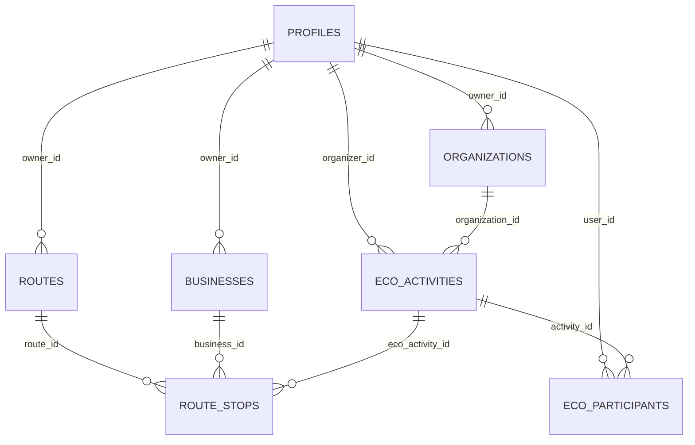

<div align="center">
  

  <br />

  <em>Turismo sostenible, comercio local y jornadas ECO en Nicaragua</em>

  <br /><br />

  [](https://flutter.dev)
  [](https://dart.dev)
  [](https://supabase.com)
  [](https://www.postgresql.org)
  [](https://developers.google.com/maps)
  
</div>

<br />

<div align="center">
  <sub>Conectando viajeros con negocios locales y jornadas de impacto ambiental — un turismo que le devuelve algo a Nicaragua.</sub>
</div>

<br />

<div align="center">


**[Descripción general](#descripción-general)** · **[Perfiles de usuario](#perfiles-de-usuario)** · **[Tecnologías](#tecnologías-utilizadas)** · **[Arquitectura y BD](#arquitectura-y-base-de-datos)** · **[Instalación](#instalación-y-ejecución)** · **[Comandos](#comandos-útiles)**

</div>

<br />


## Descripción general

**Níkara** es una aplicación móvil desarrollada en **Flutter** (con soporte adicional para Web y Windows Desktop) que conecta a **turistas** con **negocios locales** — hospedaje, gastronomía, tours, artesanía — y con **jornadas ECO** de impacto ambiental (limpiezas de playas, reforestación, voluntariado).

El objetivo es promover un turismo responsable que:

- **Economía local** — da visibilidad a emprendedores turísticos y gastronómicos.
- **Cuidado ambiental** — impulsa jornadas ecológicas organizadas por fundaciones y usuarios.
- **Exploración guiada** — facilita mapas interactivos, rutas personalizadas e itinerarios por días.

> [!NOTE]
> La interfaz está íntegramente en español y el diseño se deriva 1:1 del archivo Figma **"UI-NÍKARA"** — es la fuente de verdad visual del proyecto.

<br />


## Perfiles de usuario

El sistema define **4 roles**, gestionados sobre la tabla `profiles` de Supabase:

| Rol | Descripción |
|---|---|
|  | Descubrimiento de lugares y negocios, creación de itinerarios personalizados y exploración del mapa interactivo. |
|  | Registro y gestión de sus propios negocios turísticos y gastronómicos (perfil, ubicación, fotos, contacto). |
|  | Moderación de contenido, aprobación de comercios publicados por emprendedores y gestión general de la plataforma. |
|  | Supervisión de métricas de la plataforma y verificación del cumplimiento de impacto sostenible en las jornadas ECO. |

<br />


## Tecnologías utilizadas

| Categoría | Tecnología | Detalle |
|---|---|---|
|  | Flutter (Dart) | Android e iOS — con soporte adicional para Web y Windows Desktop |
|  | Supabase | PostgreSQL + Auth + Storage |
|  | Google Maps API | SDK para Flutter (`google_maps_flutter`) + Directions API para ruteo ("Cómo llegar") + `geolocator` |
|  | Supabase Auth | Correo/contraseña, Google Sign-In, Sign in with Apple |
|  | `google_fonts`, `font_awesome_flutter`, `flutter_svg` | Fuente personalizada **Leelawadee** |
|  | `shared_preferences` | Sesión de invitado, favoritos, extras de perfil |

<br />


## Arquitectura y base de datos

### Estructura de carpetas

El proyecto sigue una organización **feature-first**:

```
lib/
├── core/            # Compartido entre features: models, services, supabase, utils
├── features/        # auth · business · eco · home · map · profile · routes · settings
│   └── <feature>/
│       ├── data/           # Servicios (singleton) que hablan con Supabase
│       ├── domain/         # Modelos
│       └── presentation/   # Screens + widgets
├── shared/          # Widgets reutilizados entre features (main_layout, guest_guard, etc.)
└── theme/           # AppColors + AppTheme (tokens ligados a Figma)
```

### Esquema de base de datos (Supabase / PostgreSQL)

El backend vive completamente en Supabase. El esquema se construye ejecutando en orden los scripts SQL de `supabase/sql/` (`001_...` → `013_...`), que cubren: perfiles y roles, negocios con geolocalización (`PostGIS`), organizaciones, jornadas ECO y participantes, rutas/itinerarios por días, notificaciones, reseñas y favoritos.



> [!IMPORTANT]
> Ninguna migración de `supabase/sql/` se aplica automáticamente — cada una debe ejecutarse **a mano y en orden** desde el SQL Editor del dashboard de Supabase. El detalle completo de cada tabla, incluyendo el diagrama DBML, está en [`docs/database_erd.md`](docs/database_erd.md).

<br />


## Instalación y ejecución

### Requisitos previos

- [Flutter SDK](https://docs.flutter.dev/get-started/install) `3.44.5` (Dart `^3.12.2`) — verificar con `flutter --version`
- [Git](https://git-scm.com/)
- Emulador Android/iOS configurado, o dispositivo físico conectado (también corre en Chrome o Windows Desktop)

### 1. Clonar el repositorio

```bash
git clone <url-del-repositorio>
cd nikara_app
```

### 2. Instalar dependencias

```bash
flutter pub get
```

### 3. Configurar las claves de entorno

> [!IMPORTANT]
> La app necesita una clave de la API de Google (Directions) para el ruteo "Cómo llegar". Sin este paso, `flutter run` sigue funcionando con una key de respaldo embebida, pero **se recomienda configurar la propia** para desarrollo real.

```bash
cp dart_defines.json.example dart_defines.json
```

Editar `dart_defines.json`:

```json
{
  "GOOGLE_MAPS_API_KEY": "tu_clave_aqui"
}
```

> [!NOTE]
> La URL y `anon key` de Supabase ya están configuradas en `lib/core/supabase/supabase_config.dart` (son públicas por diseño; el proyecto usa RLS deshabilitada intencionalmente). Para apuntar a un proyecto Supabase propio, reemplazar esos valores ahí. Adicionalmente, para renderizar el mapa nativo, configurar la key del SDK de Maps en `android/local.properties` (Android) y `ios/Flutter/Maps.xcconfig` (iOS).

### 4. Inicializar la base de datos

Ejecutar en orden, sobre el proyecto Supabase (SQL Editor del dashboard o CLI), todos los scripts de `supabase/sql/` desde `001_profiles_trigger_and_rls.sql` hasta `013_final_schema_additions.sql`.

### 5. Ejecutar la aplicación

```bash
flutter run --dart-define-from-file=dart_defines.json
```

<details>
<summary>Otros targets disponibles</summary>

```bash
flutter run -d chrome     # Web
flutter run -d windows    # Windows Desktop
```

</details>

<br />


## Comandos útiles

| Comando | Descripción |
|---|---|
| `flutter analyze` | Linting estático |
| `dart format .` | Formateo de código |
| `flutter test` | Ejecutar la suite de pruebas |
| `flutter build apk / web / windows` | Build de release |

<br />

---

<div align="center">
  

  <br />

  <sub><strong>Descubre Nicaragua · Apoya lo local · Cuida el planeta</strong></sub>
</div>
