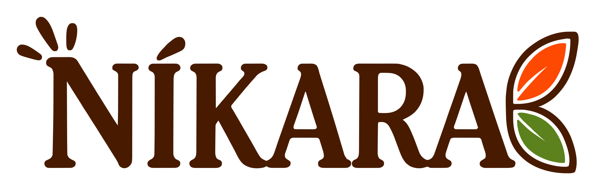
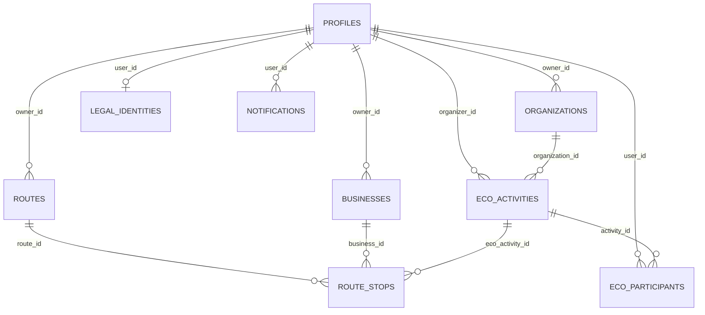

<div align="center">
  

  <br />

  <em>Turismo sostenible, comercio local y jornadas ECO en Nicaragua</em>

  <br /><br />

  [](https://flutter.dev)
  [](https://dart.dev)
  [](https://supabase.com)
  [](https://www.postgresql.org)
  [](https://developers.google.com/maps)
  
</div>

<br />

<div align="center">
  <sub>Conectando viajeros con negocios locales y jornadas de impacto ambiental — un turismo que le devuelve algo a Nicaragua.</sub>
</div>

<br />

<div align="center">


**[Descripción general](#descripción-general)** · **[Perfiles de usuario](#perfiles-de-usuario)** · **[Tecnologías](#tecnologías-utilizadas)** · **[Arquitectura y BD](#arquitectura-y-base-de-datos)** · **[Instalación](#instalación-y-ejecución)** · **[Comandos](#comandos-útiles)**

</div>

<br />


## Descripción general

**Níkara** es una plataforma digital de turismo sostenible que conecta a viajeros con destinos turísticos conocidos y emergentes de Nicaragua mediante mapas interactivos, navegación GPS y experiencias comunitarias verificadas.

La plataforma permite descubrir lugares auténticos, apoyar pequeños emprendimientos locales y distribuir mejor el flujo turístico hacia zonas menos visitadas, contribuyendo al desarrollo económico de las comunidades y a la conservación del patrimonio natural y cultural.

- **Economía local** — visibilidad y herramientas de gestión para emprendedores turísticos y gastronómicos.
- **Cuidado ambiental** — jornadas ecológicas organizadas por fundaciones y usuarios, con impacto medible.
- **Turismo distribuido** — mapas y rutas que también llevan al viajero a destinos emergentes, no solo a los ya masificados.

> [!NOTE]
> La interfaz está íntegramente en español y el diseño se deriva 1:1 del archivo Figma **"UI-NÍKARA"** — es la fuente de verdad visual del proyecto.

<br />


## Perfiles de usuario

El sistema define **3 roles**, gestionados sobre la tabla `profiles` de Supabase:

| Rol | Descripción |
|---|---|
|  | Descubrimiento de lugares y negocios, creación de itinerarios personalizados y exploración del mapa interactivo. |
|  | Registro de negocios y fundaciones (con verificación de identidad legal vía RUC/cédula), gestión de sus jornadas ECO y solicitudes de publicación. |
|  | Revisión y aprobación/rechazo de negocios, fundaciones y jornadas ECO enviadas por emprendedores, y moderación general de la plataforma. |

> [!NOTE]
> Existió un cuarto rol, `auditor`, definido al inicio del proyecto pero nunca usado en la práctica — se retiró del sistema de permisos. El tipo `user_role` de Postgres puede conservar el valor sin que nada dependa de él.

<br />


## Tecnologías utilizadas

| Categoría | Tecnología | Detalle |
|---|---|---|
|  | Flutter (Dart) | Android, iOS, web y desktop (Windows) |
|  | Supabase | PostgreSQL + Auth + Storage. RLS deshabilitada a propósito (ver nota abajo); las aprobaciones de negocios/fundaciones/jornadas ECO pasan por RPCs de Postgres que sí validan el rol server-side. |
|  | Google Maps API | SDK para Flutter (`google_maps_flutter`) + Directions API para ruteo ("Cómo llegar") + `geolocator` |
|  | Supabase Auth | Correo/contraseña, Google Sign-In, Apple Sign-In, Facebook (redirect OAuth) |
|  | Firebase Cloud Messaging + `flutter_local_notifications` | Solo capa de entrega de push; Supabase sigue siendo la fuente de verdad de los datos |
|  | `google_fonts`, `font_awesome_flutter`, `flutter_svg`, `flutter_animate`/`animations` | Tipografía **League Spartan** (títulos) + **Nunito** (cuerpo) |
|  | `shared_preferences` | Sesión de invitado, favoritos, extras de perfil |

### Sistema de diseño

Fuente de verdad: Figma **"UI-NÍKARA"** para pantallas existentes, prototipos de Claude Design para pantallas nuevas/rediseños. 2 tipografías y 2 familias de color de marca (**Gold** y **Olive**), cada una con como máximo una variante `Fill` (relleno) y una `Text` (texto/íconos, ≥4.5:1 de contraste):

 

 `goldFill #FDBE02` &nbsp;&nbsp;  `oliveFill #C2CA5B` &nbsp;&nbsp;  `oliveText #6B7033`

> [!NOTE]
> Gold nunca es color de texto (su versión oscurecida a contraste seguro se lee como bronce, no como dorado). El fondo de pantalla (`background #F7F3EC`) y el de tarjetas/inputs (`surface #FDFDFD`) son tokens deliberadamente distintos para que las tarjetas se lean apoyadas sobre el fondo. El naranja/coral (`#FF8243`, gradiente `sunset*`) ya no es una familia de marca — quedó reservado a las pantallas **Expresivas** (Auth/onboarding); el resto de la app ("Funcional") usa como máximo un acento de marca visible a la vez, con la excepción documentada del módulo ECO (Gold + Olive conviven porque el oliva ahí comunica categoría, no decoración).

<br />

**Escala de espaciado y radios** (`AppSpacing`/`AppRadius`, `lib/theme/app_spacing.dart`) — derivada de la frecuencia real de uso en el código, no de Figma: `4 · 8 · 12 · 16 · 20 · 24 · 32`px, con 16px como valor por defecto de padding/radio de tarjeta.

<br />


## Arquitectura y base de datos

### Estructura de carpetas

El proyecto sigue una organización **feature-first**:

```
lib/
├── core/            # Compartido entre features: models, services, supabase, utils
├── features/        # admin · auth · business · eco · home · map · my_business
│                     # · notifications · profile · routes · settings
│   └── <feature>/
│       ├── data/           # Servicios (singleton) que hablan con Supabase
│       ├── domain/         # Modelos
│       └── presentation/   # Screens + widgets
├── shared/          # Widgets reutilizados entre features (main_layout, guest_guard, etc.)
└── theme/           # AppColors + AppTextStyles + AppSpacing (tokens ligados a Figma/Claude Design)
```

No todas las features tienen los tres subniveles (`data`/`domain`/`presentation`) — se agregan según se necesiten.

### Modelo de datos

El backend vive completamente en Supabase (PostgreSQL). El diagrama resume las entidades principales y sus relaciones:



> [!NOTE]
> `businesses`/`organizations`/`eco_activities` tienen una columna `status` (`pendiente` · `aprobado` · `rechazado`) que decide su publicación. El cliente nunca la escribe con un `update` directo: aprobar/rechazar pasa por RPCs de Postgres (`review_business`, `review_organization`, `review_eco_activity`) que validan server-side que quien llama sea `admin`. `legal_identities` guarda una identidad legal (RUC o cédula) por usuario, verificada una vez y reutilizada en cualquier negocio/fundación que esa cuenta registre después.

<br />


## Instalación y ejecución

### Requisitos previos

- [Flutter SDK](https://docs.flutter.dev/get-started/install) `3.44.5` (Dart `^3.12.2`) — verificar con `flutter --version`
- [Git](https://git-scm.com/)
- Emulador Android/iOS configurado, o dispositivo físico conectado

### 1. Clonar el repositorio

```bash
git clone <url-del-repositorio>
cd nikara_app
```

### 2. Instalar dependencias

```bash
flutter pub get
```

### 3. Configurar las claves de entorno

> [!IMPORTANT]
> La app carga un archivo `.env` en tiempo de ejecución (`dotenv.load` en `main.dart`) y **no arranca sin él** — no hay clave de respaldo embebida. Crear `.env` en la raíz del proyecto:

```env
GOOGLE_MAPS_API_KEY=tu_clave_aqui
```

Esa clave es para las llamadas HTTP a la Directions API ("Cómo llegar"), independiente de la key nativa del SDK de Maps.

> [!NOTE]
> La URL y `anon key` de Supabase ya están configuradas en `lib/core/supabase/supabase_config.dart` (son públicas por diseño; el proyecto usa RLS deshabilitada intencionalmente). Para apuntar a un proyecto Supabase propio, reemplazar esos valores ahí. Adicionalmente, para renderizar el mapa nativo, configurar la key del SDK de Maps en `android/local.properties` (Android) y `ios/Flutter/Maps.xcconfig` (iOS). Las notificaciones push (Firebase Cloud Messaging) usan `android/app/google-services.json`, que ya está versionado en el repo.

### 4. Ejecutar la aplicación

```bash
flutter run                # dispositivo/emulador móvil
flutter run -d chrome      # web
flutter run -d windows     # desktop Windows
```

<br />


## Comandos útiles

| Comando | Descripción |
|---|---|
| `flutter analyze` | Linting estático (`flutter_lints`) |
| `dart format .` | Formateo de código |
| `dart format --output=none --set-exit-if-changed .` | Check de formato sin escribir (CI/hooks) |
| `flutter test` | Ejecutar toda la suite de pruebas |
| `flutter test test/widget_test.dart` | Ejecutar un solo archivo de tests |
| `flutter build apk` / `web` / `windows` | Build de release |

<br />

---

<div align="center">
  

  <br />

  <sub><strong>Descubre Nicaragua · Apoya lo local · Cuida el planeta</strong></sub>
</div>
