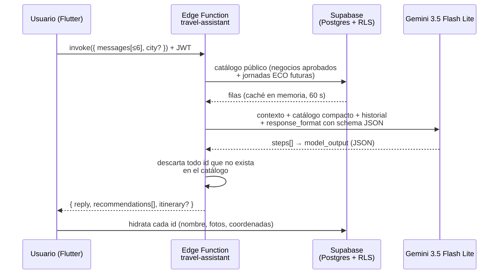
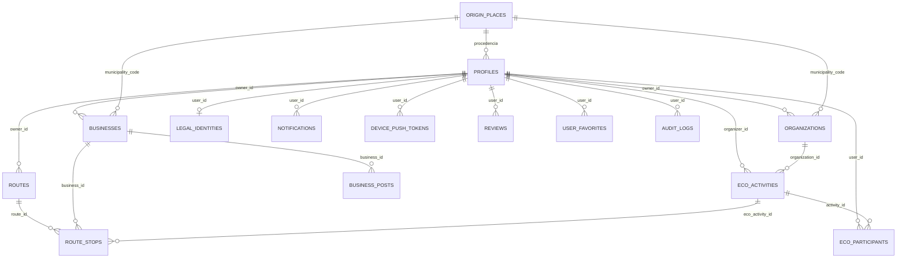

<div align="center">
  

  <br />

  <em>Turismo sostenible, comercio local y jornadas ECO en Nicaragua</em>

  <br /><br />

  [](https://flutter.dev)
  [](https://dart.dev)
  [](https://supabase.com)
  [](https://www.postgresql.org)
  [](https://developers.google.com/maps)
  [](https://firebase.google.com/docs/cloud-messaging)
  
</div>

<br />

<div align="center">
  <sub>Conectando viajeros con negocios locales y jornadas de impacto ambiental — un turismo que le devuelve algo a Nicaragua.</sub>
</div>

<br />

<div align="center">


**[Descripción general](#descripción-general)** · **[Funcionalidades](#funcionalidades)** · **[Perfiles de usuario](#perfiles-de-usuario)** · **[Tecnologías](#tecnologías-utilizadas)** · **[Arquitectura y BD](#arquitectura-y-base-de-datos)** · **[Instalación](#instalación-y-ejecución)** · **[Comandos](#comandos-útiles)** · **[Pruebas](#pruebas-y-validación)**

</div>

<br />


## Descripción general

**Níkara** es una plataforma digital de turismo sostenible que conecta a viajeros con destinos turísticos conocidos y emergentes de Nicaragua mediante mapas interactivos, navegación GPS y experiencias comunitarias verificadas.

La plataforma permite descubrir lugares auténticos, apoyar pequeños emprendimientos locales y distribuir mejor el flujo turístico hacia zonas menos visitadas, contribuyendo al desarrollo económico de las comunidades y a la conservación del patrimonio natural y cultural.

- **Economía local** — visibilidad y herramientas de gestión para emprendedores turísticos y gastronómicos.
- **Cuidado ambiental** — jornadas ecológicas organizadas por fundaciones y usuarios, con aforo y seguimiento de participantes.
- **Turismo distribuido** — mapas, rutas y filtros geográficos que también llevan al viajero a destinos emergentes, no solo a los ya masificados.

La app es una sola base de código Flutter para **Android, iOS, web y Windows desktop** (el uso real y la validación visual se hacen sobre Android, en orientación vertical fija).

> [!NOTE]
> La interfaz está íntegramente en español. El diseño se deriva del archivo Figma **"UI-NÍKARA"** para las pantallas existentes y de los prototipos de **Claude Design** para pantallas nuevas y rediseños — esas dos son la fuente de verdad visual del proyecto.

<br />


## Funcionalidades

| Módulo | Qué hace |
|---|---|
| **Inicio / Descubrimiento** | Catálogo de negocios y lugares con filtros por categoría y por geografía (departamento · municipio · cabecera), destinos sugeridos y favoritos. |
| **Mapa interactivo** | Mapa con marcadores por categoría, búsqueda, filtros conectados al listado, selección de ubicación y ruteo real **"Cómo llegar"** vía Directions API. |
| **Rutas y modo viaje** | Wizard para armar rutas con paradas (negocios y jornadas ECO), vista de recorrido, seguimiento de progreso y **guía por voz** durante el viaje (`flutter_tts`). |
| **Pasaporte turístico** | Colección de postales de viaje que se desbloquean al completar recorridos, con lógica de insignias y gamificación. |
| **Asistente de viaje con IA** | Chat conversacional sobre **Gemini 3.5 Flash Lite** que recomienda lugares y arma itinerarios por días **eligiendo ids del catálogo real** de Níkara, así que no puede inventar lugares. Detalle de la integración [más abajo](#asistente-de-viaje-con-ia-gemini). |
| **Negocios** | Registro por wizard con verificación de identidad legal (RUC/cédula), fotos, horarios, subcategoría, *day pass* de hospedaje y canal de **publicaciones** tipo novedades. |
| **Jornadas ECO** | Fundaciones/organizaciones con perfil propio, creación de jornadas con cupo (**aforo validado en Postgres**), inscripción/baja con confirmación y listado público de participantes. |
| **Perfiles** | Perfil privado + **perfil público** con nombre público, bio, avatar y **procedencia** (país/ciudad/municipio desde catálogo INIDE) con controles de privacidad por campo. |
| **Reseñas** | Calificación 1–5 con comentario y fotos sobre negocios y jornadas, con actualización en tiempo real. |
| **Notificaciones** | Dos capas: avisos **in-app** (tabla `notifications`) y **push al teléfono** vía FCM, encadenados automáticamente por trigger + Edge Function. |
| **Panel de administración** | Bandeja de revisión de negocios, fundaciones y jornadas pendientes, con aprobación/rechazo mediante RPCs que validan el rol en el servidor. |
| **Cuenta y sesión** | Correo/contraseña, Google, Apple y Facebook; modo invitado, cambio rápido entre cuentas y eliminación de cuenta. |

<br />


## Perfiles de usuario

El sistema define **3 roles**, gestionados sobre la tabla `profiles` de Supabase:

| Rol | Descripción |
|---|---|
|  | Descubrimiento de lugares y negocios, rutas e itinerarios propios, pasaporte turístico, reseñas, favoritos e inscripción a jornadas ECO. |
|  | Todo lo del turista, más registro de negocios y fundaciones (con verificación de identidad legal vía RUC/cédula), publicaciones del negocio y gestión de sus jornadas ECO. |
|  | Revisión y aprobación/rechazo de negocios, fundaciones y jornadas ECO enviados por emprendedores, y moderación general de la plataforma. |

> [!NOTE]
> Existió un cuarto rol, `auditor`, definido al inicio del proyecto y nunca usado en la práctica. Se retiró del sistema de permisos y ya no es aceptado por los RPC de revisión. El valor sigue existiendo en el tipo `user_role` de Postgres (quitarlo de un enum obliga a recrear la columna y sus policies), pero hoy no otorga ningún permiso.

<br />


## Tecnologías utilizadas

| Categoría | Tecnología | Detalle |
|---|---|---|
|  | **Flutter 3.44.5 / Dart ^3.12.2** | Android, iOS, web y desktop (Windows). Sin codegen (`build_runner`/`freezed`): los modelos se serializan a mano. |
|  | Servicios singleton + `setState` | Decisión deliberada: sin Provider/Riverpod/Bloc. Patrón `XService()` con instancia cacheada (referencia: `lib/core/services/auth_service.dart`). |
|  | **Supabase** (PostgreSQL + Auth + Storage) | **RLS activo** en todas las tablas del esquema. Las aprobaciones pasan por RPCs de Postgres que validan el rol server-side; PostGIS para consultas geográficas. |
|  | **Edge Functions** (Deno) | `get-directions` (proxy de Directions API), `travel-assistant` (Gemini) y `send-push` (FCM HTTP v1). Guardan las API keys como secretos del servidor. |
|  | **Google Gemini 3.5 Flash Lite** (`gemini-3.5-flash-lite`) | Asistente de viaje, vía la **Interactions API** de Google (`generativelanguage.googleapis.com/v1beta/interactions`) con salida JSON forzada por schema. Se consume **solo desde la Edge Function `travel-assistant`**, nunca desde Dart. |
|  | `google_maps_flutter`, `geolocator` | Tiles vía SDK nativo + ruteo "Cómo llegar" vía Edge Function. |
|  | Supabase Auth | Correo/contraseña, Google Sign-In, Apple Sign-In y Facebook (redirect OAuth). |
|  | `firebase_messaging`, `flutter_local_notifications` | Firebase es **solo el transporte** del push: no hay Firestore ni Realtime Database, Supabase es la única fuente de verdad. |
|  | `flutter_tts` | Indicaciones habladas durante el modo viaje. |
|  | `google_fonts`, `font_awesome_flutter`, `flutter_svg`, `flutter_animate`, `animations` | Tipografía **League Spartan** (títulos) + **Nunito** (cuerpo), servida por `google_fonts` (sin fuentes empaquetadas). |
|  | `shared_preferences` | Sesión de invitado, favoritos (con caché offline por cuenta), pasaporte y extras de perfil. |
|  | `image_picker`, `url_launcher`, `uuid`, `crypto`, `http` | Subida de fotos, enlaces externos (WhatsApp/redes), ids y hashing del nonce de Apple Sign-In. |

### Sistema de diseño

2 tipografías y **3 primitivos de color de marca**, cada uno con como máximo una variante `Fill` (relleno) y una `Text` (texto/íconos, contraste ≥4.5:1 WCAG AA):

 

 `goldFill #FDBE02` &nbsp;&nbsp;  `oliveFill #C2CA5B` &nbsp;&nbsp;  `oliveText #6B7033` &nbsp;&nbsp;  `orangeFill #FF8243`

> [!NOTE]
> **Ningún `Fill` de marca lleva texto blanco encima** — los tres son claros. Gold nunca es color de texto (su versión oscurecida a contraste seguro se lee como bronce, no como dorado). El fondo de pantalla (`background #F7F3EC`) y el de tarjetas/inputs (`surface #FDFDFD`) son tokens deliberadamente distintos para que las tarjetas se lean apoyadas sobre el fondo.

Cada pantalla declara un **tier**: *Expresiva* (Splash/Login/Registro y onboarding — única autorizada a usar el gradiente completo de los 3 `Fill`) o *Funcional* (todo lo demás — como máximo un acento de marca visible a la vez, con la excepción documentada del módulo ECO, donde el oliva comunica categoría y no decoración).

| Capa | Archivo | Contenido |
|---|---|---|
| Color | `lib/theme/app_colors.dart` | Primitivos de marca + tokens semánticos (`background`, `surface`, `textPrimary/Secondary/Inverted`, `border`, `error`, `destructive`, `success`, `ecoAccent`). |
| Tipografía | `lib/theme/app_theme.dart` | `AppTextStyles` — solo `fontSize`/`fontWeight`/`height`; el color se aplica por composición en el widget. |
| Espaciado | `lib/theme/app_spacing.dart` | `AppSpacing`/`AppRadius` en grilla de 4pt: `4 · 8 · 12 · 16 · 20 · 24 · 32`px (16px por defecto en padding/radio de tarjeta). |
| Movimiento | `lib/theme/app_motion.dart` | Duraciones (`micro` 150ms · `quick` 200ms · `standard` 250ms · `large` 320ms) y curvas; nunca un `Duration`/`Curves` literal en una pantalla. |

**Accesibilidad de movimiento**: `AppMotion.reduced(context)` / `AppMotion.respect(context, d)` respetan el ajuste del sistema ("Eliminar animaciones" en Android, "Reduce Motion" en iOS) — ya aplicado en las transiciones de pantalla, el fondo aurora y el splash.

**Transiciones de pantalla**: todas viven en `lib/shared/widgets/app_page_transition.dart` (paquete `animations`) y se eligen por el significado de la navegación — shared axis para entrar en una jerarquía, fade through para cambiar de raíz (login/logout). No queda ningún `MaterialPageRoute` en `lib/`.

<br />


## Arquitectura y base de datos

### Estructura de carpetas

El proyecto sigue una organización **feature-first**:

```
lib/
├── core/            # Compartido entre features
│   ├── services/        # auth · directions · favorites · location · passport ·
│   │                    # legal_identity · tts · account_switcher · user_stats …
│   ├── gamification/    # Motor de insignias del pasaporte
│   └── models/ navigation/ supabase/ utils/
├── features/        # admin · ai_assistant · auth · business · eco · home · map ·
│   │                # my_business · notifications · profile · routes · settings
│   └── <feature>/
│       ├── data/           # Servicios (singleton) que hablan con Supabase
│       ├── domain/         # Modelos (serialización manual fromRow/toJson)
│       └── presentation/   # Screens + widgets
├── shared/          # Widgets reutilizados entre features (main_layout, guest_guard,
│                    # eco_badge, app_page_transition, geographic_filter_bar, …)
└── theme/           # AppColors · AppTextStyles · AppSpacing · AppMotion
```

No todas las features tienen los tres subniveles (`data`/`domain`/`presentation`) — se agregan según se necesiten.

### Backend

```
supabase/              # no versionado en este repo (ver "Archivos no versionados")
├── sql/               # 44 migraciones numeradas, aplicadas a mano y en orden
└── functions/
    ├── get-directions/    # Proxy de la Google Directions API
    ├── travel-assistant/  # Asistente de viaje (Gemini) sobre el catálogo real
    └── send-push/         # Entrega FCM (API HTTP v1), disparada por trigger
```

Cadena completa del push: se inserta una fila en `notifications` → el trigger `on_notification_created` llama a `send-push` → la función firma un JWT con la cuenta de servicio, lee `device_push_tokens` y habla con FCM → el teléfono dibuja el aviso.

### Asistente de viaje con IA (Gemini)

| | |
|---|---|
| **Proveedor** | Google AI (Gemini Developer API) |
| **Modelo** | `gemini-3.5-flash-lite` — fijado como valor por defecto en la función, sobrescribible con la variable de entorno `GEMINI_MODEL` sin publicar una versión nueva de la app |
| **Endpoint** | `POST https://generativelanguage.googleapis.com/v1beta/interactions` (**Interactions API**, que reemplazó a `generateContent` como estándar en junio de 2026; exige el header `Api-Revision: 2026-05-20`) |
| **Autenticación** | Header `x-goog-api-key` con el secreto `GEMINI_API_KEY`, que vive **solo** en Supabase |
| **Dónde corre** | Edge Function `supabase/functions/travel-assistant/index.ts` (Deno) |
| **Cliente** | `AssistantService` (`lib/features/ai_assistant/data/assistant_service.dart`) — invoca la función con `_client.functions.invoke('travel-assistant', ...)`; **no existe ningún SDK de Gemini en `pubspec.yaml`** |

#### Flujo de una pregunta


```mermaid
sequenceDiagram
    participant U as Usuario (Flutter)
    participant F as Edge Function<br/>travel-assistant
    participant S as Supabase<br/>(Postgres + RLS)
    participant G as Gemini 3.5 Flash Lite

    U->>F: invoke({ messages[≤6], city? }) + JWT
    F->>S: catálogo público (negocios aprobados<br/>+ jornadas ECO futuras)
    S-->>F: filas (caché en memoria, 60 s)
    F->>G: contexto + catálogo compacto + historial<br/>+ response_format con schema JSON
    G-->>F: steps[] → model_output (JSON)
    F->>F: descarta todo id que no exista<br/>en el catálogo
    F-->>U: { reply, recommendations[], itinerary? }
    U->>S: hidrata cada id (nombre, fotos, coordenadas)
```

#### Cómo evita alucinar

Esto es el núcleo del diseño, no un detalle de implementación:

1. **El modelo no escribe nombres de lugares: elige `id`s** de un catálogo que la función le pasa en el prompt (id, kind, nombre, categoría, ciudad, flag eco y descripción recortada a 140 caracteres).
2. **Salida estructurada obligatoria** — se manda un `response_format` con `schema` JSON (`respuesta`, `recomendaciones[]`, `itinerario?`), así la respuesta se parsea en vez de interpretarse con expresiones regulares.
3. **Validación server-side de cada id**: la función descarta toda recomendación o parada de itinerario cuyo id no esté en el catálogo, y **toma el `kind` del catálogo, no del modelo** (si se equivoca de tipo, la app abriría la pantalla incorrecta). Un día de itinerario que queda sin paradas tras el filtro no se muestra.
4. Si se descartan ids, queda un `console.warn` en los logs — es la señal temprana de que hay que endurecer el prompt.
5. **Flutter hidrata los ids contra Supabase**: nombres, fotos y coordenadas los pone la base de datos. El modelo solo redacta el texto y el motivo de cada recomendación.

Resultado: que el asistente recomiende un hostal inexistente no es improbable, es **imposible**.

#### Decisiones de integración

- **Pasa por una Edge Function, no habla con Gemini desde Dart**, por dos razones: la API key quedaría como texto plano dentro del APK, y el id del modelo es una variable de entorno del servidor (a `gemini-2.0-flash` lo apagaron nueve meses después de salir — un retiro se resuelve editando un campo en vez de publicando una app nueva).
- **El catálogo se lee con el JWT del usuario, no con la `service_role key`**: RLS ya permite leer negocios aprobados y jornadas ECO, así que la clave privilegiada no hace falta. Se cachea 60 s en memoria del worker, y se puede compartir entre usuarios porque son las mismas filas públicas que cualquiera ve en el mapa.
- **Solo jornadas futuras** entran al catálogo: recomendar una jornada que ya pasó es peor que no recomendar nada.
- **Historial de 6 mensajes** (recortado en el cliente y otra vez en el servidor) para mantener el hilo sin que el prompt crezca sin control. Los mensajes de error no se reenvían: si el modelo lee sus propias disculpas, empieza a disculparse en cadena.
- **Errores en español, listos para mostrar**: `429` del tier gratuito (10 peticiones/minuto) devuelve *"Estoy atendiendo a varias personas ahora mismo…"*; falta de secreto devuelve `503`; salida no parseable, `502`.
- **Consumo medido, no estimado**: cada turno deja en los logs el modelo, los tokens de entrada/salida/cacheados y el tamaño del catálogo.
- **Los hilos de conversación se guardan en el dispositivo** (`SharedPreferences`, vía `AssistantConversationStore`), no en Supabase.

> [!IMPORTANT]
> **Privacidad.** En el tier gratuito de Gemini, Google usa el contenido para mejorar sus productos. Por eso al prompt van **únicamente** el catálogo público de negocios y jornadas, el texto que el usuario escribe y, opcionalmente, su ciudad aproximada — nunca su correo, teléfono, cédula ni el nombre de su perfil.

### Modelo de datos

El backend vive completamente en Supabase (PostgreSQL + PostGIS). El diagrama resume las entidades principales y sus relaciones:


```mermaid
erDiagram
    PROFILES ||--o{ BUSINESSES : "owner_id"
    PROFILES ||--o{ ORGANIZATIONS : "owner_id"
    PROFILES ||--o{ ROUTES : "owner_id"
    PROFILES ||--o{ ECO_ACTIVITIES : "organizer_id"
    PROFILES ||--o{ ECO_PARTICIPANTS : "user_id"
    PROFILES ||--o| LEGAL_IDENTITIES : "user_id"
    PROFILES ||--o{ NOTIFICATIONS : "user_id"
    PROFILES ||--o{ DEVICE_PUSH_TOKENS : "user_id"
    PROFILES ||--o{ REVIEWS : "user_id"
    PROFILES ||--o{ USER_FAVORITES : "user_id"
    PROFILES ||--o{ AUDIT_LOGS : "user_id"
    ORIGIN_PLACES ||--o{ PROFILES : "procedencia"
    ORIGIN_PLACES ||--o{ BUSINESSES : "municipality_code"
    ORIGIN_PLACES ||--o{ ORGANIZATIONS : "municipality_code"
    ORGANIZATIONS ||--o{ ECO_ACTIVITIES : "organization_id"
    ECO_ACTIVITIES ||--o{ ECO_PARTICIPANTS : "activity_id"
    BUSINESSES ||--o{ BUSINESS_POSTS : "business_id"
    ROUTES ||--o{ ROUTE_STOPS : "route_id"
    BUSINESSES ||--o{ ROUTE_STOPS : "business_id"
    ECO_ACTIVITIES ||--o{ ROUTE_STOPS : "eco_activity_id"
```

| Tabla | Para qué |
|---|---|
| `profiles` | Fila 1:1 con `auth.users` (creada por trigger). Rol, puntos, avatar, perfil público y procedencia. |
| `public_profiles` | **Vista** con lo único visible de otra persona (`id`, `full_name`, `avatar_url`, `role`, `points`) — sin correo ni teléfono. |
| `businesses` | Negocios turísticos, con ubicación `geography(Point,4326)`, subcategoría, day pass y `status` de revisión. |
| `business_posts` | Canal de novedades del negocio (texto + 1 foto), lectura pública y escritura solo del dueño. |
| `organizations` / `eco_activities` / `eco_participants` | Fundaciones, jornadas ECO (con aforo y "momentos") e inscripciones. |
| `routes` / `route_stops` | Rutas de usuario y sus paradas (negocio o jornada ECO). |
| `reviews` | Calificación 1–5 + comentario y media sobre negocio o jornada. |
| `user_favorites` | Favoritos de negocios, jornadas y rutas, únicos por usuario e ítem. |
| `notifications` / `device_push_tokens` | Avisos in-app y tokens FCM por dispositivo. |
| `legal_identities` | Una identidad legal (RUC o cédula) por usuario, verificada una vez y reutilizable. |
| `origin_places` | Catálogo de solo lectura con 153 municipios y cabeceras (códigos INIDE). |
| `audit_logs` | Registro de auditoría, accesible solo a `service_role`. |

Detalle columna por columna en [`docs/database_erd.md`](docs/database_erd.md); procedencia y privacidad en [`docs/user_origin.md`](docs/user_origin.md); descubrimiento geográfico en [`docs/discovery_geography.md`](docs/discovery_geography.md).

### Seguridad

> [!IMPORTANT]
> **RLS (Row Level Security) está activo** en todas las tablas del esquema (las 12 de `029_enable_rls.sql` más las agregadas después), y también en la vista `public_profiles`. El servidor evalúa la pertenencia en cada consulta, venga de la app o de un `curl` directo a PostgREST: leer perfiles, cédulas, tokens de push o favoritos ajenos devuelve `[]`, e insertar a nombre de otro devuelve `42501 violates row-level security`.

- Las lecturas intencionalmente públicas (listar negocios, jornadas, participantes) **no** se filtran por dueño — es la función central de la app.
- Las consultas "mis X" y **todas** las mutaciones llevan el filtro de dueño en la misma sentencia, y la columna de dueño se estampa siempre desde la sesión activa, nunca con un valor recibido de la UI.
- Aprobar/rechazar pasa por los RPCs `review_business`, `review_organization` y `review_eco_activity`, que validan el rol `admin` en el servidor.
- La `anon key` de `lib/core/supabase/supabase_config.dart` es **pública por diseño** (viaja dentro del APK de todas formas); lo que la vuelve inofensiva es RLS. La `service_role key` vive únicamente en los secretos de Supabase y nunca debe aparecer en `lib/`.
- Los errores de Supabase nunca llegan crudos a la UI: se traducen a un mensaje amigable en español.

<br />


## Instalación y ejecución

### Requisitos previos

- [Flutter SDK](https://docs.flutter.dev/get-started/install) `3.44.5` (Dart `^3.12.2`) — verificar con `flutter --version`
- [Git](https://git-scm.com/)
- Android Studio / Xcode con un emulador configurado, o un dispositivo físico conectado
- Una cuenta de [Google Cloud](https://console.cloud.google.com/) con **Maps SDK** habilitado, para la key nativa del mapa

### 1. Clonar el repositorio

```bash
git clone https://github.com/JaBaca67/Nikara-Hackathonic.git
cd nikara_app
```

### 2. Instalar dependencias

```bash
flutter pub get
```

### 3. Configurar la key nativa de Google Maps

Es la única clave que hay que poner a mano para que el mapa pinte tiles. Crear o editar **`android/local.properties`** (está en `.gitignore`; Flutter/Android Studio lo autogeneran con `sdk.dir` al abrir el proyecto) y agregar:

```properties
MAPS_API_KEY=tu_clave_de_android_aqui
```

`android/app/build.gradle.kts` la lee de ahí y la inyecta en el `AndroidManifest.xml` vía `manifestPlaceholders`. Para iOS, el equivalente es **`ios/Flutter/Maps.xcconfig`** con `GOOGLE_MAPS_API_KEY=...` (es una credencial distinta: se restringe por bundle ID en vez de paquete + SHA-1).

> [!TIP]
> **Síntoma clásico**: el mapa no carga y solo aparece el logo de Google en la esquina. Sin key válida el SDK se inicializa pero no dibuja tiles. Si la key está puesta y el mapa sigue en blanco, revisá el log de Android por `Authorization failure` / `API key not authorized`: la key suele estar restringida por **paquete + huella SHA-1**, y cada máquina genera su propio `debug.keystore`. Obtené la huella con `cd android && ./gradlew signingReport` y agregala en Google Cloud Console → *Credentials* → esa key → *Application restrictions*.

> [!NOTE]
> **Ya no existe ningún archivo `.env`.** La key de la Directions API ("Cómo llegar") y la de Gemini viven como secretos de Supabase y nunca salen del servidor, así que no hay nada que configurar en el cliente para esas dos. Si ves un `MapsConfig` o un import de `flutter_dotenv` en una rama vieja, es código muerto.

### 4. Archivos no versionados

El repositorio es público, así que algunos archivos se mantienen solo en local. **La app no compila sin el primero**; pedilos por un canal privado a alguien del equipo, nunca por git:

| Archivo | Para qué | Si falta |
|---|---|---|
| `lib/firebase_options.dart` | Config de Firebase que importa `main.dart` | **La compilación falla.** Regenerar con `flutterfire configure` sobre el proyecto de Firebase, o copiarlo del equipo. |
| `android/local.properties` → `MAPS_API_KEY` | Tiles del mapa en Android | El mapa queda en blanco (paso 3). |
| `ios/Flutter/Maps.xcconfig` | Tiles del mapa en iOS | Ídem, en iOS. |
| `supabase/` (`sql/` + `functions/`) | Esquema y Edge Functions | La app funciona igual contra el backend ya desplegado; solo hace falta para **recrear la base desde cero** o redesplegar las funciones. |

`android/app/google-services.json` **sí** está versionado en el repo, así que el push funciona sin configurarlo.

> [!NOTE]
> La URL y la `anon key` de Supabase ya están en `lib/core/supabase/supabase_config.dart` y apuntan al proyecto compartido: **no hace falta crear un backend propio para correr la app**. Para apuntar a un proyecto Supabase distinto, reemplazar esos valores ahí, aplicar las migraciones de `supabase/sql/` en orden en el SQL Editor (ninguna se aplica automáticamente) y desplegar las tres Edge Functions con sus secretos (`GOOGLE_MAPS_API_KEY`, `GEMINI_API_KEY`, `FCM_PROJECT_ID`/`FCM_CLIENT_EMAIL`/`FCM_PRIVATE_KEY`).

### 5. Ejecutar la aplicación

```bash
flutter devices             # ver los dispositivos disponibles
flutter run                 # dispositivo/emulador móvil
flutter run -d chrome       # web
flutter run -d windows      # desktop Windows
flutter run -d <device-id>  # un dispositivo específico
```

<br />


## Comandos útiles

| Comando | Descripción |
|---|---|
| `flutter pub get` | Instalar dependencias |
| `flutter analyze` | Linting estático (`flutter_lints`) |
| `dart format .` | Formateo de código |
| `dart format --output=none --set-exit-if-changed .` | Check de formato sin escribir (CI/hooks) |
| `flutter test` | Ejecutar toda la suite de pruebas |
| `flutter test test/widget_test.dart` | Ejecutar un solo archivo de tests |
| `flutter build apk` / `web` / `windows` | Build de release |
| `dart run flutter_launcher_icons` | Regenerar los iconos de app desde `assets/icon/` |

<br />


## Pruebas y validación

La suite tiene **50 archivos de test** (`flutter test`), que cubren tanto lógica como render de pantallas. Dos de ellos siguen convenciones propias del proyecto que conviene conocer antes de agregar uno nuevo:

- **`test/overflow_audit_test.dart`** — renderiza pantallas con datos deliberadamente peores que cualquier input real (nombres y descripciones larguísimas) para forzar `RenderFlex overflow`. Al agregar una pantalla con texto dinámico de negocio, considerá sumarla ahí.
- **`test/reduce_motion_test.dart`** — verifica que las animaciones respeten "Eliminar animaciones" del sistema.

> [!IMPORTANT]
> `AuthService` toca `Supabase.instance` de forma síncrona, así que **todo** widget test necesita en `setUpAll`: `SharedPreferences.setMockInitialValues({})` seguido de `Supabase.initialize(...)` con credenciales falsas (no hace falta un proyecto real). En pantallas con el fondo aurora, usar `tester.pump()` con duración explícita en vez de `pumpAndSettle()` — la animación es infinita y nunca termina de asentarse.

Antes de dar por terminada una pantalla, la validación visual se hace **sobre dispositivo Android real** (no en navegador): da el viewport móvil de verdad (384dp de ancho lógico), además de las fuentes y el renderer reales. El detalle del protocolo — incluida la trampa de que el framebuffer se captura en Display P3 y los colores de marca se desplazan — está en [`CLAUDE.md`](CLAUDE.md).

<br />

---

<div align="center">
  

  <br />

  <sub><strong>Descubre Nicaragua · Apoya lo local · Cuida el planeta</strong></sub>
</div>
