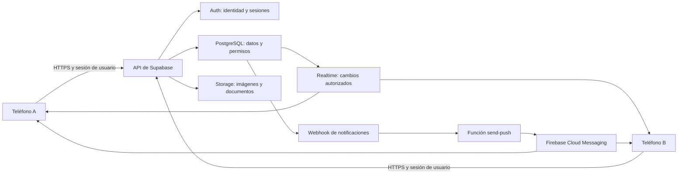

# Auditoría de conectividad y persistencia — Sprint 2 de Níkara

> **Actualización posterior:** este archivo conserva los hallazgos del código anterior a las correcciones. Consulta [cambios y estado actual de los datos remotos](cambios_datos_remotos.md) para los cambios implementados, las 570 pruebas aprobadas y la migración pendiente. La indicación anterior de conservar cachés queda reemplazada por la instrucción del usuario de no guardar nuevo contenido de cuenta en el dispositivo.

Fecha local: **8 de octubre de 2026, America/Guatemala**. Verificación remota: `2026-10-09T00:25:44Z` (18:25 del día 8 en Guatemala).

## 1. Dictamen para la evaluación

**La plataforma ya tiene una integración real con Supabase, pero todavía no puede presentarse como completamente sincronizada entre dispositivos.** Los servicios de usuarios, negocios, organizaciones, jornadas, inscripciones, reseñas, rutas y notificaciones realizan operaciones remotas. Existen acciones visibles que solo cambian memoria o almacenamiento del teléfono, y varios mecanismos de actualización no cubren una pantalla abierta en un segundo dispositivo.

Los faltantes más importantes son:

1. **Editar cuenta y cambiar contraseña en Ajustes:** muestran éxito sin hacer una escritura remota.
2. **Preferencias de notificaciones y privacidad:** los interruptores solo duran durante la visita a Ajustes; no gobiernan los permisos ni los avisos del servidor.
3. **Pasaporte, postales y progreso de viaje:** son locales. Hay una sincronización parcial de eventos para notificaciones, pero la colección se reconstruye exclusivamente desde el teléfono.
4. **Nombre de usuario y conversaciones:** se guardan en claves locales globales; además de no viajar entre dispositivos, no están separados por cuenta.
5. **Sincronización de favoritos y pantallas de detalle:** faltan recargas remotas en algunos flujos; un cambio guardado puede no verse en B aunque B siga abierto.
6. **Verificación por teléfono, recuperación de contraseña y Apple:** requieren implementación o configuración pendiente.
7. **Reglas del servidor y despliegue:** hay que verificar políticas, triggers, Storage, RPC, cron y Edge Functions; la existencia de columnas no demuestra que esos controles estén activos.

La demostración debe probar **acción en A → dato confirmado en servidor → lectura autorizada en B**, y repetirla después de cerrar y abrir la app. Un mensaje de éxito o un cambio visual en A por sí solo no demuestra persistencia.

## 2. Qué se verificó y con qué alcance

| Evidencia | Resultado | Qué permite concluir |
| --- | --- | --- |
| Revisión de `lib/`, pantallas, servicios y almacenamiento local | Flujos contrastados con las llamadas remotas | Qué implementa el código actual y dónde quedan datos locales. |
| Revisión de `supabase/sql/001…048` | 49 archivos SQL, dos con prefijo `039` | Qué propone el repositorio; no garantiza ejecución en el proyecto. |
| API PostgREST del proyecto configurado | **20/20 consultas HTTP 200**, columnas explícitas, `LIMIT 0`, cero filas | Reconoce las columnas solicitadas en **19 tablas y una vista**. Incluye `reviews_backup`; no incluye `spatial_ref_sys`. |
| Configuración pública de Auth | HTTP 200 | Registro habilitado; correo, Google y Facebook habilitados; Apple y teléfono deshabilitados; confirmación automática de correo activada. |
| Metadatos OpenAPI | HTTP 401 | No se pudo enumerar RPC con esta solicitud. No implica que falten RPC. |
| Pruebas existentes seleccionadas | **98 pruebas aprobadas**, salida 0 | Lógica y widgets cubiertos por esa selección; varios usan HTTP simulado y preferencias simuladas. |
| Prueba real con dos teléfonos | **Pendiente** | No se certificaron eventos en vivo, escrituras con cuentas reales ni entrega push. |

Archivos de evidencia:

- [Resultado de API](verificacion_api.json).
- [Script reproducible de solo lectura](../../scripts/audit_sprint2_connectivity.py).
- [Consultas del backend de solo lectura](verificar_backend.sql).
- [Selección y resultado de pruebas](pruebas_ejecutadas.md).

No se crearon usuarios, no se enviaron mensajes o push, no se ejecutaron RPC ni se modificó la base. Las consultas de API no descargaron filas de usuarios. La revisión tampoco inspeccionó secretos de `.env`.

Los estados siguientes significan:

- **Remoto implementado:** el código llama a Supabase; necesita prueba real para certificar el flujo completo.
- **Parcial:** combina servidor con estado local o no cubre actualización remota.
- **Local:** existe una implementación, pero el servidor no es su fuente de datos.
- **Pendiente:** acción incompleta o configuración externa sin validar.

## 3. Arquitectura que hay que explicar a la mentora



La conectividad entre dispositivos se consigue usando **el mismo proyecto de Supabase como fuente compartida**. El móvil usa la API y su sesión; no abre una conexión PostgreSQL con contraseña ni necesita comunicarse directamente con otro teléfono.

Son tres garantías diferentes:

| Garantía | Ejemplo | Prueba necesaria |
| --- | --- | --- |
| Persistencia | Crear una reseña y recuperarla tras reiniciar | Volver a leer desde servidor. |
| Sincronización | Entrar con la misma cuenta en B y recuperar favoritos | Leer datos remotos por UUID de usuario, sin depender de A. |
| Actualización en vivo | B ya está abierto y recibe una inscripción hecha en A | Suscripción, publicación de tabla, permisos y recarga de la pantalla. |

`ValueNotifier`, `revision`, `setState` y `notifyListeners` actualizan el proceso donde se ejecutan. No son mensajes entre teléfonos. Realtime requiere que el servidor publique la tabla y que el cliente se suscriba y procese eventos. [Documentación oficial de Postgres Changes](https://supabase.com/docs/guides/realtime/postgres-changes).

Dos escenarios deben probarse por separado: **misma cuenta en dos dispositivos** para datos privados, y **cuentas diferentes** para contenido compartido y permisos. B no debe ver el teléfono, correo, documento o favoritos privados de A por el hecho de estar conectado.

## 4. Registro de usuarios: datos, destino y ciclo de vida

### 4.1 Secuencia implementada

1. Paso Identidad: recoge correo y contraseña; valida el formulario.
2. Paso Perfil: recoge nombres, apellidos, nombre de usuario, teléfono con prefijo, procedencia y foto opcional.
3. `RegisterScreen._createAccountAndContinue` concatena nombres y apellidos en `fullName`, construye el teléfono y llama a `AuthService.signUp`.
4. Supabase Auth recibe correo, contraseña y metadatos: `full_name`, `phone`, `residence_type`, `origin_country_code`, `origin_city`, `origin_municipality`.
5. El trigger esperado `on_auth_user_created` ejecuta `handle_new_user` y crea `public.profiles` con **el mismo UUID** de `auth.users`. El rol inicial esperado es `turista`, definido en servidor.
6. El nombre de usuario se escribe en `SharedPreferences`. No se envía en la solicitud de registro.
7. Con sesión disponible, la foto se sube al bucket `avatars` y su URL se escribe en `profiles.avatar_url`. Si falla, la cuenta sigue existiendo y se informa del problema.
8. Paso Verificación: el botón de OTP es un stub; saltar guarda `false` localmente. No se verifica la posesión del teléfono.

El uso de una tabla de perfiles enlazada a Auth y un trigger de alta coincide con el patrón documentado por Supabase. Un trigger defectuoso puede bloquear registros, por lo que hay que comprobarlo en el proyecto. [Gestión oficial de usuarios](https://supabase.com/docs/guides/auth/managing-user-data).

### 4.2 Inventario de campos

| Dato del formulario | Destino implementado | Relación/limitación |
| --- | --- | --- |
| Correo | Auth y `profiles.email` mediante trigger | La copia del perfil se crea al alta; no se encontró sincronización general para futuros cambios de correo. |
| Contraseña | Servicio Supabase Auth | No hay columna de contraseña en el perfil ni escritura local de la contraseña desde este flujo. |
| Nombres y apellidos | Metadata `full_name` y `profiles.full_name` | Se conserva el nombre completo concatenado, no dos columnas separadas. |
| Nombre de usuario | `local_username` en preferencias del dispositivo | No es un identificador remoto; no tiene unicidad en BD ni separación por cuenta. |
| Teléfono y prefijo | Metadata `phone` y `profiles.phone` | Es un texto de contacto declarado. No prueba posesión ni equivale a un teléfono verificado de Auth. |
| Residencia nacional/extranjera | `profiles.residence_type` | `nicaraguan` o `foreign`. |
| País | `profiles.origin_country_code` | Para extranjero basta país válido distinto de NI; ciudad y municipio no se envían. |
| Ciudad y municipio nicaragüenses | `profiles.origin_city`, `origin_municipality` | Validados contra el catálogo de origen; comprobar la FK compuesta y el trigger desplegados. |
| Foto | Objeto en `avatars` + URL en `profiles.avatar_url` | El archivo y la fila son operaciones distintas. |
| Verificación telefónica | `local_is_phone_verified=false` | No hay OTP real; no debe convertirse en atributo confiable por escritura del cliente. |
| UUID | Generado por Auth, utilizado en `profiles.id` | Debe enlazar todas las acciones a la persona correcta. |
| Rol y puntos | Perfil, definidos/controlados en servidor según migraciones | El registro no envía un rol arbitrario; los puntos calculados en interfaz aún no se sincronizan. |

### 4.3 Configuración actual confirmada

La respuesta de `/auth/v1/settings` devuelve `disable_signup=false`, `external.email=true`, `google=true`, `facebook=true`, `apple=false`, `phone=false`, `mailer_autoconfirm=true` y `phone_autoconfirm=false`.

Por tanto, **actualmente no debe afirmarse que el correo se verificó mediante un enlace ni que se envió un SMS**. Google y Facebook están habilitados en el proyecto, pero todavía se debe probar el flujo completo de proveedor, firma del APK y retorno a la app. Apple está deshabilitado y `SupabaseConfig.appleServiceId` contiene un marcador sin reemplazar.

Si se habilita confirmación de correo más adelante, registro creado y sesión iniciada son estados diferentes. El código ya contempla que la foto pueda no subirse sin sesión; hay que completar el retorno del enlace y la pantalla de confirmación.

### 4.4 Prueba concreta de alta

En A registrar una cuenta de evaluación con un correo controlado por el equipo. En Authentication verificar existencia de la identidad. En la tabla `profiles` comprobar el mismo UUID, nombre, teléfono y procedencia. Iniciar sesión en B con esa cuenta: deben recuperarse esos datos y el avatar. No esperar que viaje el nombre de usuario actual: es un faltante confirmado.

No presentar correo, teléfono o cédula reales en la grabación. Para la evidencia basta el UUID de prueba y los valores ficticios del perfil de evaluación.

## 5. Matriz de acciones y relación con la base

| Módulo/acción | Destino | Estado | Observación para A y B |
| --- | --- | --- | --- |
| Registro, login por contraseña | Auth + `profiles` | Remoto implementado | Verificar trigger, duplicados, credenciales incorrectas y sesión en ambos teléfonos. |
| Google/Facebook | Auth + perfil por trigger | Remoto implementado | Proveedores habilitados; falta demostrar retorno y alta del perfil. |
| Apple | Auth | Pendiente | Proveedor deshabilitado y configuración local incompleta. |
| Recuperar contraseña | Ninguno desde la acción actual | Pendiente | Login muestra que estará disponible pronto. |
| Verificar teléfono/reenviar OTP | Estado de onboarding local | Pendiente | No hay envío ni validación remota. |
| Editar nombre/correo/teléfono en Ajustes | `SettingsController` en memoria | Local | Mensaje de éxito sin PATCH a Auth/perfil. Se pierde al salir. |
| Cambiar contraseña en Ajustes | Diálogo local | Local | Valida campos y devuelve `true`; no llama a Auth. |
| Editar perfil público y procedencia | `profiles` + vista `public_profiles` | Remoto implementado | Tiene actualización y retorno de fila; recargar perfil en B. |
| Subir/eliminar avatar | `avatars` + `profiles.avatar_url` | Remoto implementado | Recuperar URL desde B y validar imagen. |
| Privacidad y preferencias en Ajustes | Memoria del controlador | Local | No controla `public_profiles`, permisos de GPS ni automatizaciones. |
| Registrar/editar/eliminar negocio | `businesses` | Remoto implementado | Propietario por sesión, estado de revisión y coordenadas PostGIS. |
| Fotografías/logo del negocio | Bucket `businesses` + campos URL | Remoto implementado | URLs accesibles en B; revisar restos de subidas fallidas. |
| Publicaciones del negocio | `business_posts` + imagen | Remoto implementado | Escritura real; el detalle no tiene suscripción a publicaciones. |
| Cédula/RUC e imágenes | `legal_identities` + bucket privado | Remoto implementado | Dueño/admin según políticas; probar acceso denegado a terceros. |
| Registrar/editar/eliminar fundación | `organizations` + imágenes | Remoto implementado | Aprobación y dueño remotos; el servicio tiene avisos locales de cambios. |
| Crear/editar/eliminar jornada | `eco_activities` | Remoto implementado | Organización propietaria comprobada por cliente; verificar también relación y autorización en servidor. |
| Unirse/salir de jornada | `eco_participants` | Remoto implementado | UNIQUE por jornada/persona; aforo requiere trigger activo. |
| Momentos ECO y controles del foro | `reviews` + RPC de política + imágenes | Remoto implementado | Tiene reglas atómicas propuestas y suscripciones a cambios. |
| Escribir/editar/eliminar reseña | `reviews` + bucket `reviews` | Remoto implementado | El servicio maneja actualización de reseña propia y carreras; comprobar índice parcial desplegado. |
| Favorito de negocio con UUID y cuenta | `user_favorites` + caché local por cuenta | Parcial | Viaja al servidor; el servicio no relee tras hidratar ni escucha eventos remotos. |
| Favoritos con slug/destinos heredados | Preferencias + `mock_destinations.dart` | Local | No caben en `item_id uuid`. Revisar datos heredados, no tratarlos como catálogo remoto. |
| Crear/copiar/editar/eliminar ruta | `routes` + `route_stops` | Remoto implementado | Dos o más llamadas sin transacción conjunta; riesgo de resultados parciales. |
| Publicar ruta y leer comunidad | `routes.is_public` + paradas | Parcial | Feed escucha `routes`; cambios solo de `route_stops` no generan ese evento. |
| Marcar parada visitada/omitida | Preferencias por cuenta y ruta | Local | B no recupera el checklist de A. |
| Finalizar ruta propia | `routes.status` | Remoto implementado | Diferente del progreso de paradas local; no equivale a recuperar todo el viaje en B. |
| Postales y colección del pasaporte | Preferencias por usuario | Local | Hay envío parcial de eventos a BD para avisos, pero lectura de colección local. |
| Puntos, nivel e insignias | Cálculo en Flutter | Parcial | Usa viajes locales; `profiles.points` no recibe ese resultado. |
| Notificaciones: listar, leer, borrar | `notifications` | Remoto implementado | Persistentes; cambios de lectura hechos en B no tienen suscripción de tabla en A. |
| Recomendaciones y premios automáticos | Tablas de automatización + RPC/cron | Parcial | Confirmar despliegue y job; avisos demo también existen. |
| Push al teléfono | `device_push_tokens` → webhook → `send-push` → FCM | Parcial | Código presente; falta validar configuración, entrega y salida de cuenta. |
| IA: consulta y recomendaciones | `travel-assistant` + catálogo de BD | Remoto implementado | Validar Edge Function, secreto y modelo activo; no se invocó en esta auditoría. |
| IA: historial de conversación | Preferencias globales | Local | Mismo teléfono comparte historial entre cuentas; B no lo recupera. |
| GPS, cálculo de trayecto, voz | Dispositivo + `get-directions`/Maps | Parcial | Consulta de rutas remota; navegación activa local. No hay rastreo compartido implementado. |
| Panel admin y aprobar/rechazar | Tablas + RPC `review_*` | Remoto implementado | Comprobar rol en servidor y cambios en cuenta del propietario. |
| Auditoría de acciones | Tabla `audit_logs` | Pendiente | Está definida; no se encontró escritor de acciones de la app en el código revisado. |
| Métricas de vistas y contactos | `DashboardMetric.comingSoon` | Pendiente | “Vistas” y contactos por WhatsApp no tienen registro de eventos implementado en el dashboard revisado. |
| Eliminar cuenta | RPC `delete_own_user` | Parcial | Código real; requiere RPC desplegado, FK compatibles y ciclo de limpieza de Storage. |
| Ayuda, términos y acerca de | Mensaje “Próximamente” | Pendiente | No requieren necesariamente una tabla, pero la pantalla no ofrece el contenido aún. |

La presencia de un servicio o tabla habilitada no equivale a certificar toda la fila anterior. Las lecturas y escrituras reales están pendientes de la prueba funcional con usuarios de evaluación.

## 6. Hallazgos priorizados y criterios de cierre

**P0:** resolver o delimitar explícitamente antes de afirmar funcionamiento completo. **P1:** necesario para demostrar continuidad entre dispositivos. **P2:** siguiente mejora o función opcional según alcance del sprint. Las prioridades son de preparación de esta evaluación, no estimaciones de tiempo.

| ID | Prioridad | Hallazgo y evidencia | Cambio recomendado | Criterio de cierre |
| --- | --- | --- | --- | --- |
| H01 | P0 | Ajustes confirma edición de perfil solo en memoria. `settings_account_screen.dart`, `settings_controller.dart`. | Guardar nombre/teléfono en perfil; cambio de correo mediante Auth, con confirmación y sincronización de la copia. Retornar éxito después de respuesta válida. | B y reinicio de A recuperan el cambio; al fallar la red no aparece éxito. |
| H02 | P0 | El diálogo de contraseña solo devuelve `true`. Recuperación es mensaje de pendiente en `login_screen.dart`. | Implementar actualización de Auth y recuperación con enlace/retorno y comprobación de estado de sesión. | Nueva contraseña funciona desde una sesión nueva en B; la anterior falla; recuperación completa. |
| H03 | P0 | Interruptores de privacidad/avisos solo llaman `notifyListeners`. | Persistir preferencias por usuario y aplicarlas en vista/políticas o envío de avisos según su significado. | Reinicio conserva estado; otro usuario obtiene solo datos permitidos; avisos respetan la elección. |
| H04 | P0 | Las políticas locales de INSERT de negocio/fundación/jornada solo validan dueño. `guard_review_columns` está instalado para UPDATE, no INSERT, y no protege `is_verified`. | Revisar privilegios reales y exigir estado inicial pendiente/campos de revisión controlados en servidor; controlar también la verificación. | Un usuario ordinario no puede crear una fila autoaprobada ni marcarse verificado por API directa. Hallazgo estático; no se intentó explotar el servidor. |
| H05 | P0 | `send-push` recibe `record` y usa privilegios elevados; su handler local no comprueba explícitamente un secreto del webhook ni el origen. No hay configuración de despliegue versionada que pruebe restricción a llamadas internas. | Exigir autenticación de servicio/webhook y leer la notificación legítima por ID; comprobar permisos desplegados. | Solicitud de cliente ordinario es rechazada; webhook autorizado entrega una notificación real. No se probó envío ni explotación en producción. |
| H06 | P1 | `PassportService.getCollection` lee solo preferencias por cuenta, aunque publica eventos mediante RPC. | Usar viajes/postales remotos como fuente compartida; recuperar la colección del servidor y conservar caché. | Completar en A, cerrar A y recuperar en B la misma postal y fecha. |
| H07 | P1 | `RouteTravelService` guarda visited/skipped en clave por cuenta/ruta. | Persistir progreso individual por cuenta y recorrido; definir estados y conflictos entre dispositivos. | B abre ruta y recupera visitas/omisiones hechas en A. |
| H08 | P1 | `UserStatsService` calcula puntos con viajes locales; `profiles.points` no se escribe desde esos flujos. | Unificar cálculo de progreso en servidor o derivarlo de eventos remotos coherentes; no confiar en puntos arbitrarios enviados por móvil. | A, B y lectura de perfil público coinciden cuando muestran esa métrica. |
| H09 | P1 | Favoritos remotos quedan hidratados durante la sesión; no hay Realtime ni actualización forzada. | Añadir refresh remoto y recuperación al volver a primer plano, o suscripción por usuario con reconciliación. | B ya abierto refleja alta y eliminación en A sin reiniciar; no resucita favoritos borrados. |
| H10 | P1 | Detalle de negocio guarda un snapshot; publicaciones cargan al abrir/cambiar ID. Feed de rutas escucha solo cabecera. | Recargar datos afectados al evento, al volver al primer plano y al retornar de edición; incluir paradas y anuncios cuando corresponde. | B abierto refleja reseña/publicación/cambio de paradas de A dentro del tiempo acordado. |
| H11 | P1 | `createRoute` inserta cabecera y luego paradas; `replaceStops` borra y luego inserta. | RPC transaccional de creación/edición, validación de dueño y versión/conflictos en servidor. | Fallo intermedio no crea itinerario incompleto ni borra las paradas previas; reintento no duplica. |
| H12 | P1 | `local_username` y `assistant_conversations_v1` son globales. Servicios de intereses/verificación también usan claves globales, aunque no se encontraron pantallas consumidoras de intereses. | Nombre de usuario remoto si es identidad ofrecida; historial separado por cuenta y remoto si se exige continuidad; invitado separado. | Cambiar de cuenta no muestra conversación de otra persona; identidad recuperable en B. |
| H13 | P1 | Compatibilidad de esquema puede reintentar quitando datos: extras de negocio, fotos de ruta, media de reseña, reverso de documento. | Exigir versión mínima de esquema o avisar claramente pérdida parcial; probar lectura posterior de cada campo. | Todo campo aceptado por wizard se recupera idéntico. Hoy las columnas consultadas existen, por lo que no se confirmó pérdida actual. |
| H14 | P1 | Guardado de favorito usa upsert; SQL local no define política UPDATE de favoritos. Métrica de guardados lee filas sujetas a RLS privada. | Probar reintento/conflicto del upsert y ajustar operación/política mínima. Para dueño usar RPC de conteo autorizado sin abrir favoritos ajenos. | Dos dispositivos guardan el mismo favorito sin error; dueño ve conteo real de varios usuarios, sin sus identidades. |
| H15 | P1 | Subidas y escrituras de filas no comparten transacción. Borrar cuenta usa dos DELETE SQL y no gestiona objetos de Storage. | Definir compensación para subidas, limpieza autorizada de objetos y ciclo de eliminación completo. | Cuenta de prueba con avatar/documentos se elimina; no quedan objetos innecesarios ni sesiones capaces de seguir acciones sensibles. |
| H16 | P1 | RLS vincula inscripción a usuario, pero el trigger de aforo solo controla cantidad. Validez por fecha/estado se comprueba principalmente en cliente. Relaciones organización/organizador también requieren regla explícita. | Comprobar reglas de negocio server-side para inscribirse y crear jornadas dentro de una organización permitida. | API directa no permite inscripción a jornada cerrada/pasada/no publicada ni creación bajo organización ajena. |
| H17 | P2 | OTP es stub; teléfono deshabilitado y correo autoconfirmado. Apple deshabilitado/marcador. | Implementar proveedores y flujos si forman parte del compromiso del sprint; comunicar estado pendiente hasta entonces. | OTP real y verificación confiable, o alcance de demo documentado; Apple solo presentado tras prueba real. |
| H18 | P2 | `audit_logs` sin escritor en lo revisado; FK actual a perfil puede bloquear borrado al empezar a escribir. | Triggers o eventos de auditoría del servidor, con entidad/acción/fecha y política de anonimización compatible con eliminar cuenta. | Operación genera rastro verificable; auditoría no acepta falsificación desde cliente ni rompe eliminación. |
| H19 | P2 | Destinos heredados con slug y referencias polimórficas de favoritos/reseñas no tienen FK al destino. UNIQUE de paradas mezcla columnas nullable. | Migrar destinos usados a catálogo real; definir limpieza/validación y unicidad por tipo de parada. | No hay favoritos/reseñas inválidos ni paradas duplicadas por carreras; borrados conservan coherencia. |
| H20 | P2 | Dashboard de negocio/fundación/jornada presenta métricas de vistas/contactos como próximas. `my_business_service.dart`. | Registrar eventos si estas métricas se comprometen; separar valor real, cero real y error de consulta. | Evento de evaluación genera conteo; fallo de red no se interpreta como ausencia de actividad. |
| H21 | P1 | `PushTokenService` intenta borrar el token al recibir `signedOut`, cuando la sesión ya terminó; la política DELETE exige dueño autenticado. La solicitud puede no borrar ninguna fila. | Retirar token antes del cierre con la sesión vigente, o invalidar token FCM; comprobar filas afectadas y recuperación de errores. | Cuenta cerrada deja de recibir push en ese dispositivo, incluso sin iniciar una nueva cuenta. Hallazgo estático, no entrega real probada. |
| H22 | P1 | Algunas escrituras, como update/delete de ruta y marcar aviso leído, no verifican filas afectadas. Un filtro de dueño/RLS o un borrado concurrente puede producir cero filas sin excepción. | Confirmar fila devuelta/estado final y diferenciar operación idempotente de edición que no se realizó. | Editar una entidad eliminada o sin permiso no muestra éxito; reintentos idempotentes mantienen resultado coherente. |
| H23 | P1 | `_initPush` se ejecuta antes de `runApp`; `getInitialMessage` intenta navegar cuando el navegador raíz aún no tiene contexto y `_openNotifications` retorna. | Mantener intención de apertura pendiente y procesarla tras primer frame y resolución de sesión. | Tocar push con app completamente cerrada abre la bandeja después del arranque. Hallazgo estático; falta prueba en dispositivo. |

Los hallazgos H04, H05, H14 y H16 describen diferencias o riesgos visibles en código/SQL local. **Su estado efectivo en producción depende del catálogo y configuración desplegados** y debe comprobarse antes de afirmar una vulnerabilidad explotable.

En el detalle ECO, la suscripción actual refresca Momentos cuando está seleccionada esa pestaña; no certifica que el encabezado y la lista de participantes se refresquen al mismo tiempo. Probar inscripción y baja con esa pantalla abierta, además del feed general. El callback de Realtime debe actualizar el dato que el usuario está viendo.

Para H02, Supabase documenta actualización de contraseña y correo mediante Auth: [Flutter `updateUser`](https://supabase.com/docs/reference/dart/auth-updateuser). Para H04, las políticas de fila y los privilegios de columna resuelven problemas diferentes: [RLS](https://supabase.com/docs/guides/database/postgres/row-level-security), [seguridad por columna](https://supabase.com/docs/guides/database/postgres/column-level-security). Para H05, las funciones deben declarar qué credenciales aceptan: [autenticación de Edge Functions](https://supabase.com/docs/guides/functions/auth).

## 7. Qué revisar en el proyecto desplegado

Ejecutar [verificar_backend.sql](verificar_backend.sql) en el SQL Editor con la cuenta del equipo. Es de solo lectura y no contiene DDL, escritura ni envío de avisos. También se puede exportar el catálogo completo con la [consulta ya existente](../diagramacion_bd/consultar_esquema_real_supabase.sql).

| Componente | Comprobación necesaria | Señal de aceptación |
| --- | --- | --- |
| Proyecto compartido | Ambos APK usan el mismo host Supabase y versión de app | A y B apuntan al proyecto evaluado. El permiso INTERNET está en manifest principal para release. |
| Alta de perfiles | Trigger de Auth activo, función actualizada con procedencia | Cero cuentas de evaluación sin perfil. No basta encontrar el archivo `001`. |
| Tablas y vistas | Comparar columnas, tipos y restricciones reales | API ya reconoce las columnas solicitadas; tipos, defaults y reglas necesitan catálogo. |
| RLS y grants | Leer políticas y permisos actuales, incluidos INSERT de campos sensibles | Público lee contenido permitido; privados protegidos por dueño/rol; admin por RPC. |
| RPC | Existencia, firma y permisos de ejecución | Operaciones autenticadas funcionan; funciones internas no son invocables por clientes. |
| Realtime | Publicación + suscripción de cada tabla que necesita actualización | Evento observado en B y pantalla recargada. Atención a favoritos, paradas, publicaciones y lectura de avisos. |
| Storage | Buckets `avatars`, `businesses`, `organizations`, `eco_activities`, `routes`, `reviews`, `legal_identities` | Fotos públicas legibles en B; documentos privados solo con autorización y URL temporal. |
| Edge Functions | `get-directions`, `travel-assistant`, `send-push`, secretos presentes y autorización | Invocación real y logs correctos. Existencia local no acredita despliegue. |
| Automatización | `pg_cron` y job `nikara-notification-automations`, triggers de eventos y recibos | Job activo; sin premios duplicados por reintento; distinguir demo de eventos reales. |
| FCM | Registro de token por dispositivo y cuenta, permiso del sistema, credenciales de entrega | Misma cuenta puede tener tokens de A y B; logout/cambio de cuenta no entrega información de la anterior. |
| Integridad y borrado | FK de copias, referencias polimórficas, cascadas, objetos y registros de auditoría | Sin pérdidas inesperadas ni bloqueo por referencias. |

No volver a ejecutar todas las migraciones a ciegas: varias contienen seeds, backfills o cambios de datos. La presencia de dos `039` y la creación inicial de `profiles`/`businesses` desde dashboard hacen necesario contrastar el orden y el catálogo real. Los diagramas académicos de 2FN no son migraciones ejecutadas.

## 8. Guion de prueba para dos dispositivos

### Preparación

Usar A y B con la misma versión de APK. Preparar cuentas de evaluación: turista T1, turista T2, emprendedor E y admin M. M puede usar el panel desde uno de los dispositivos cambiando sesión; para una demostración más fluida, usar el panel en un tercer equipo. Las pruebas que agregan, editan o eliminan datos se hacen con entidades de evaluación.

Hacer una ronda en Wi-Fi y otra con un teléfono en datos móviles. Eso verifica que el intercambio depende del backend y no de una red local compartida. Elegir antes de la prueba un tiempo objetivo para Realtime, por ejemplo **5 segundos**, como criterio del equipo, no garantía del proveedor. Registrar tiempos observados y los casos que requieren recarga manual.

### Casos de aceptación

| Caso | Acción en A | Comprobación en servidor/B | Estado de ejecución |
| --- | --- | --- | --- |
| C01 Alta | Registrar T1 con nombre, teléfono, origen y avatar | Auth + perfil con mismo UUID; B inicia sesión y recupera campos y foto | Pendiente. |
| C02 Autenticación | Salir y entrar; intentar clave incorrecta y correo repetido | No se duplica perfil ni se entra con contraseña incorrecta | Pendiente. |
| C03 Edición de cuenta | Cambiar nombre/teléfono en Ajustes | B/reinicio recuperan cambio; validar respuesta del servidor | Faltante de implementación H01. |
| C04 Contraseña/recuperación | Cambiar contraseña y recuperar desde login | Sesión nueva B usa nueva clave; enlace de recuperación termina | Faltante H02. |
| C05 Perfil público | Modificar bio, nombre público y visibilidad de origen | B con T2 ve solo los campos permitidos; su correo/teléfono no aparece | Pendiente; el editor público sí escribe remoto. |
| C06 Privacidad/avisos | Desactivar preferencia en Ajustes | Persistencia tras reinicio y efecto real en lectura/envío | Faltante H03. |
| C07 Solicitud/aprobación | E registra negocio, M revisa | E ve pendiente; T2 no lo ve hasta aprobación; aprobado aparece en B/mapa | Pendiente. |
| C08 Fotos y datos completos | Registrar horarios, redes, servicios, day pass y fotos | B lee los mismos campos y descarga imágenes | Pendiente; detecta escrituras degradadas H13. |
| C09 Fundación/jornada | E crea fundación y jornada con cupo, M aprueba | B ve organización, fecha, cupo, contactos y coordenadas correctos | Pendiente. |
| C10 Inscripción/baja | T1 se une y se retira | BD crea/borra solo su inscripción; B organizador ve cambios de conteo/lista | Pendiente. |
| C11 Último cupo | T1 en A y T2 en B intentan tomar simultáneamente el último | Solo uno se inscribe, sin sobrecupo ni duplicado | Pendiente; exige trigger real. |
| C12 Momentos | Participante publica; organizador limita/cierra foro | B recibe el momento; nuevas escrituras respetan límites y cierre | Pendiente. |
| C13 Reseña | T1 escribe/edita una reseña con foto | BD mantiene reseña propia; B ve texto, foto, promedio y conteo actualizados | Pendiente; detalle abierto requiere atención H10. |
| C14 Favoritos | T1 en A marca/quita negocio; B tiene misma cuenta abierta | Una fila por ítem; B refleja ambos cambios sin reinicio y tras reabrir | Parcial H09/H14. |
| C15 Métrica guardados | T1 y T2 guardan negocio de E | E ve total de ambas personas sin conocer identidades | Pendiente; revisar RLS H14. |
| C16 Publicación de negocio | E publica anuncio con imagen | T2 en B ve anuncio sin cerrar detalle | Persistencia implementada; refresco pendiente H10. |
| C17 Ruta privada/pública | T1 crea privada y luego publica/copia | T2 no lee privada; al publicar la copia conserva paradas y permisos | Pendiente. |
| C18 Edición de paradas | T1 reordena/elimina parada con B abierto | B refleja orden nuevo; pérdida de red no deja ruta vacía | Parcial H10/H11. |
| C19 Progreso de ruta | T1 marca parada visitada/omitida en A | T1 en B recupera el checklist y estado | Faltante H07. |
| C20 Pasaporte/puntos | Completar viaje en A y sellar postal | B recupera sello/fecha; puntos coherentes y sin duplicar por reintento | Faltante H06/H08. |
| C21 Avisos in-app | Evento real genera aviso, usuario lo lee en B | A deja de contarlo sin leer; avisos de otra cuenta inaccesibles | Persistencia implementada; refresco parcial. |
| C22 Push | Generar evento real con app en foreground/background/cerrada | Token registrado, webhook/función/FCM entregan; tap abre bandeja y desde ella se resuelve el destino | Pendiente; verificar arranque en frío H23. |
| C23 Cambio de cuenta | Abrir T1 y cambiar a T2 en el mismo teléfono | No hereda favoritos, perfil, pasaporte, conversación ni push de T1 | Parcial: conversación global H12. |
| C24 Sin internet | Desconectar antes/durante favorito, reseña y guardado de ruta | Sin éxito falso; dato confirmado o error recuperable; reintento sin duplicar | Pendiente; pruebas simuladas aportan evidencia limitada. |
| C25 Seguridad | T2 intenta editar objeto de T1 y leer documento privado | Servidor rechaza; permiso no depende de ocultar botones | Pendiente en entorno de evaluación; no atacar producción. |
| C26 Eliminación | Eliminar cuenta de evaluación con fotos/documentos | Auth/perfil y dependencias correctos; nueva sesión no entra; Storage tratado | Pendiente H15. |
| C27 IA y continuidad | Consultar catálogo y generar/guardar ruta | Recomendaciones con ID real; ruta guardada visible en B con permisos correctos | Consulta/despliegue pendientes; chat no sincroniza. |

### Evidencia que debe guardarse por caso

```text
Caso:
Fecha y hora:
Versión del APK / dispositivo / red:
Cuenta de evaluación / UUID de entidad:
Acción realizada en A:
Tabla, campo u objeto esperado:
Respuesta o error del servidor:
Resultado de lectura en B:
Tiempo de actualización / necesitó recarga manual:
Resultado tras cerrar y abrir:
Captura o video sin datos privados:
Estado: aprobado / falló / pendiente / fuera del alcance declarado
```

Para cada caso aprobado hay que identificar la misma entidad en A, BD y B. No sustituir la comprobación por avisos demo: `HomeScreen` puede llamar a `ensureDemoNotifications`, además de activar automatizaciones y sincronizar eventos del pasaporte.

## 9. Orden sugerido de trabajo antes del sprint

1. Ejecutar diagnóstico SQL y validar configuración desplegada. Confirmar alta de perfiles, roles, aforo, Storage y autorización de push.
2. Corregir H01–H03, porque hay acciones visibles que prometen guardar y no lo hacen. Completar recuperación de contraseña si se ofrece en la evaluación.
3. Corregir o verificar reglas del servidor H04/H05/H14/H16. La interfaz no sustituye la validación remota.
4. Elegir fuente remota para pasaporte/progreso/puntos y separar datos por cuenta. Si una función se mantiene local por decisión de producto, declararlo y no afirmar continuidad en B para ella.
5. Completar refresh/Realtime en favoritos y detalles, y asegurar edición transaccional de rutas.
6. Ejecutar C01–C27 con datos de evaluación, guardar evidencia y repetir fallos corregidos. Para proveedores o funciones excluidos, dejar alcance explícito.

No se estiman horas sin conocer tamaño del equipo, fecha de evaluación ni alcance comprometido. Para priorizar una demostración, los flujos centrales son registro → perfil remoto, negocio/fundación → aprobación → descubrimiento, jornada → inscripción con aforo, reseña → lectura en B y ruta → recuperación de paradas.

## 10. Funciones locales que no necesitan base de datos por sí mismas

El tab seleccionado, abrir/cerrar un diálogo, un borrador no enviado, la ubicación actual del GPS, el trazado temporal, la reproducción de voz y la cara activa del perfil pueden seguir en memoria/dispositivo. Las credenciales de sesión y tokens de acceso son específicos de cada instalación; no se deben copiar de un móvil a otro para “sincronizar”.

Una página de ayuda o términos puede ser un archivo/versionado y no una tabla. El criterio para conectar una acción a BD es que represente **un dato de la cuenta, una operación de negocio, contenido compartido o un registro que deba sobrevivir y recuperarse desde otro dispositivo**.

“Compartir ubicación” requeriría definir destinatarios, consentimiento y duración, además de almacenar/transmitir posición; hoy el interruptor no implementa esa función. No hace falta guardar todo el recorrido GPS para demostrar descubrimiento y navegación si el producto no ofrece seguimiento compartido.

## 11. Rutas de código para revisar los hallazgos

| Área | Archivos principales |
| --- | --- |
| Arranque y proyecto | [main.dart](../../lib/main.dart), [supabase_config.dart](../../lib/core/supabase/supabase_config.dart), [manifest Android](../../android/app/src/main/AndroidManifest.xml) |
| Cuenta y registro | [auth_service.dart](../../lib/core/services/auth_service.dart), [register_screen.dart](../../lib/features/auth/presentation/screens/register_screen.dart), [login_screen.dart](../../lib/features/auth/presentation/screens/login_screen.dart), [extras locales](../../lib/core/services/local_profile_extras_service.dart) |
| Ajustes | [controlador](../../lib/features/settings/data/settings_controller.dart), [cuenta](../../lib/features/settings/presentation/screens/settings_account_screen.dart), [preferencias](../../lib/features/settings/presentation/screens/settings_preferences_screen.dart) |
| Pasaporte y progreso | [passport_service.dart](../../lib/core/services/passport_service.dart), [route_travel_service.dart](../../lib/features/routes/data/route_travel_service.dart), [user_stats_service.dart](../../lib/core/services/user_stats_service.dart) |
| Favoritos y sesiones | [favorites_service.dart](../../lib/core/services/favorites_service.dart), [account_switcher_service.dart](../../lib/core/services/account_switcher_service.dart) |
| Negocios y reseñas | [business_storage_service.dart](../../lib/features/business/data/business_storage_service.dart), [review_service.dart](../../lib/features/business/data/review_service.dart), [publicaciones](../../lib/features/business/data/business_post_service.dart), [detalle](../../lib/features/business/presentation/screens/business_detail_screen.dart) |
| ECO | [eco_service.dart](../../lib/features/eco/data/eco_service.dart), [organizaciones](../../lib/features/eco/data/organization_service.dart), [momentos](../../lib/features/eco/data/eco_moment_service.dart) |
| Rutas | [route_service.dart](../../lib/features/routes/data/route_service.dart), [wizard](../../lib/features/routes/presentation/screens/create_route_wizard_screen.dart) |
| Avisos | [notification_service.dart](../../lib/features/notifications/data/notification_service.dart), [push_token_service.dart](../../lib/features/notifications/data/push_token_service.dart), [send-push](../../supabase/functions/send-push/index.ts) |
| Conversaciones | [assistant_conversation_store.dart](../../lib/features/ai_assistant/data/assistant_conversation_store.dart) |
| Permisos y auditoría | [RLS 029](../../supabase/sql/029_enable_rls.sql), [perfil público 039](../../supabase/sql/039_user_origin_and_public_profile.sql), [aforo 039](../../supabase/sql/039_eco_capacity_guard.sql), [momentos 043](../../supabase/sql/043_eco_moment_controls.sql), [audit_logs 035](../../supabase/sql/035_audit_logs.sql) |

**Criterio de salida:** las acciones presentadas como completas deben persistir, recuperarse en B con el permiso correcto y responder de forma clara a errores. La conectividad básica quedó comprobada; la certificación del funcionamiento completo permanece pendiente de las correcciones indicadas y de las pruebas reales entre dispositivos.
