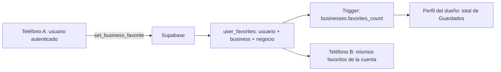

# Cambios para guardar los datos de la cuenta en Supabase

Fecha: 8 de octubre de 2026, Guatemala. Este documento actualiza la auditoría inicial; describe el código modificado y distingue las pruebas locales del despliegue pendiente.

## Estado de entrega

**El código está implementado y la suite completa aprobó 570 pruebas. Después de que el usuario ejecutara 049, las seis consultas del nuevo esquema respondieron HTTP 200 y `username_available` respondió correctamente a un formato inválido. El CSV de la verificación del servidor confirmó los 14 controles en `OK`: estructura, permisos revisados, triggers habilitados, publicación Realtime y coherencia de favoritos y puntos. Falta comprobar las acciones, el aislamiento entre usuarios y los eventos con sesiones reales; no se ha certificado una ejecución con dos teléfonos reales.**

Antes de ejecutar 049, la consulta remota de solo lectura encontró:

| Elemento | Respuesta del proyecto configurado |
| --- | --- |
| `profiles.username` | HTTP 400, columna inexistente. |
| `public_profiles.username` | HTTP 400, columna inexistente. |
| `businesses.favorites_count` | HTTP 400, columna inexistente. |
| `passport_trips` | HTTP 404, tabla no encontrada en el caché del esquema. |
| `route_visit_progress` | HTTP 404, tabla no encontrada en el caché del esquema. |
| `assistant_conversations` | HTTP 404, tabla no encontrada en el caché del esquema. |

[Verificación actualizada del esquema](verificacion_datos_remotos.json): las seis consultas ahora responden HTTP 200. [Prueba de la función del registro](verificacion_rpc_049.json): un username de formato inválido devuelve `false`, HTTP 200. Las consultas no descargaron filas ni modificaron el servidor.

El CSV proporcionado por el usuario después de ejecutar 049 contiene la columna `refresh_user_points` y celdas vacías. Es el resultado esperado de `select public.refresh_user_points(id) from public.profiles`: la función actualiza puntos y devuelve `void`, no el total calculado. Esas celdas no indican que los puntos sean cero ni demuestran por sí solas los triggers o permisos. Para comprobarlos en un solo resultado exportable está [verificar_049_resumen.sql](verificar_049_resumen.sql).

El segundo CSV, generado con el resumen de verificación y revisado el 8 de octubre, contiene **14 controles y todos están en `OK`**. Se conserva sin modificar en [resultado_verificacion_049.csv](resultado_verificacion_049.csv). Confirma 9 triggers habilitados, 14 tablas publicadas en Realtime y cero discrepancias actuales de favoritos o puntos. La publicación de tablas no demuestra por sí sola la recepción de eventos en la app; los totales coherentes tampoco sustituyen una prueba de nuevas escrituras autenticadas.

## Registro e identidad

- El registro tiene dos pasos: identidad y perfil. Se retiraron el teléfono y la pantalla SMS simulada. No se marca un teléfono como verificado.
- Supabase Auth recibe correo, contraseña y metadatos de nombre completo, nombre de usuario normalizado y procedencia. La contraseña se envía exclusivamente a Auth.
- El perfil conserva `full_name` y recibe `username` mediante un trigger durante la creación de la cuenta. La base valida el formato y exige unicidad sin distinguir mayúsculas; las cuentas OAuth pueden tener username nulo.
- La aplicación consulta `username_available` antes del alta. Una carrera entre dos registros con el mismo nombre se resuelve también en la restricción del servidor.
- El nombre de usuario se lee de `profiles` y aparece en Ajustes. Los perfiles públicos usan la vista de campos permitidos.
- Las cuentas anteriores y OAuth pueden asignar o editar su nombre de usuario desde Editar perfil en Ajustes; también se confirma la escritura remota y se rechazan duplicados.
- La foto sigue subiéndose a Storage y su URL se guarda en el perfil. Su selección temporal no se convierte en una ruta de archivo compartida.
- La edición de nombre y teléfono en Ajustes ahora espera la respuesta del perfil actualizado. El teléfono de contacto opcional en cuentas existentes no se presenta como verificado.
- El cambio de contraseña comprueba la contraseña actual mediante Auth y solicita la actualización real. La recuperación de contraseña y el cambio de correo siguen pendientes; no se presentan como guardados.

## Relación usuario–favorito–negocio

El registro privado sigue siendo `user_favorites(user_id, item_type, item_id)`. Para negocios, `item_type='business'` y `item_id` contiene el UUID real del negocio. Un usuario no puede guardar un destino de demostración con un identificador local.

`set_business_favorite` obtiene el usuario de `auth.uid()`, verifica que el negocio esté publicado y guarda o retira el favorito. Añadir repetidamente no duplica filas. “Deshacer” pide añadir explícitamente; si otro teléfono ya lo añadió, no lo quita por accidente. Una acción antigua de otra cuenta no se aplica a la nueva sesión.

Un trigger actualiza `businesses.favorites_count` y genera el cambio del negocio que recibe el dueño. El dueño consulta `business_favorite_count`, que agrega usuarios distintos sin revelar quiénes guardaron el negocio. Ya no intenta contar favoritos ajenos mediante una tabla protegida por políticas privadas.

Una consulta fallida muestra el contador como no disponible, en vez de inventar cero. Los clientes no pueden modificar el contador directamente. También se valida la relación en inserciones directas y se limpian favoritos al borrar un negocio.

La aplicación consulta nuevamente el servidor, escucha cambios y recarga al volver del segundo plano. Los corazones cambian después de la confirmación del servidor. Una escritura fallida conserva el estado anterior y permite reintentar.

## Otros datos que dejaron de depender del teléfono

| Dato / acción | Destino remoto | Relación y comportamiento |
| --- | --- | --- |
| Viaje completado y postal | `passport_trips` | Clave por usuario y viaje; negocio relacionado; instantánea construida por el servidor; reintentos idempotentes. |
| Visita u omisión en una ruta | `route_visit_progress` | Usuario + ruta + identidad estable de parada; no mezcla días ni cuentas. |
| Historial del asistente | `assistant_conversations` | Conversaciones y mensajes por usuario, con políticas de acceso propio; invitados usan memoria temporal. |
| Preferencias | `profiles` | Viajes, campañas, ofertas y perfil público se guardan por cuenta; fallos visibles y controles bloqueados durante escritura. |
| Privacidad del perfil | `public_profiles` | La vista no devuelve perfiles ocultos a otros usuarios ordinarios; sigue sin exponer correo ni teléfono. |
| Puntos | `profiles.points` | Triggers derivan puntos de viajes, favoritos y reseñas de negocios: 100, 15 y 20 respectivamente. El cliente no escribe un total elegido. |
| Nombre/rol/avatar en selector de cuentas | Lectura del perfil remoto | El selector deja de guardar esas copias en preferencias; conserva únicamente datos de acceso para alternar sesiones. |

Las novedades de negocios y recordatorios ECO respetan las preferencias mediante un trigger de notificaciones. La preferencia de ofertas se persiste, pero no crea un sistema de promociones que aún no existe. Se retiró el interruptor de compartir ubicación porque no tenía efecto implementado.

Se agregaron recargas por eventos remotos y al regresar a la aplicación para los datos de cuenta y métricas del dueño. Las rutas también escuchan cambios de `route_stops`, además de cambios de su cabecera. El historial y Ajustes reaccionan a actualizaciones de sus datos.

La aplicación dejó de crear automáticamente avisos de demostración al cargar Inicio. Esto no certifica el despliegue de cron o de las funciones push.

## Datos antiguos y sesiones

No se escriben nuevos favoritos, viajes, progreso, conversaciones ni extras de perfil en preferencias del dispositivo. El estado visual actual vive en memoria mientras la pantalla está abierta.

Las credenciales de sesión continúan usando el almacenamiento del SDK y del selector de cuentas. Esto permite volver a entrar sin pedir la contraseña en cada apertura; no se usa como fuente de favoritos, postales o preferencias. El correo del selector es un identificador de acceso.

Los viajes y el progreso antiguos con un UUID de dueño se transfieren al iniciar la cuenta. Su copia antigua se elimina únicamente después de las respuestas válidas del servidor; si falta conexión, esquema o un destino válido, se conserva para reintentar. Las instantáneas trasladadas se reconstruyen con el negocio actualmente publicado y mantienen las fechas del viaje.

Los nombres de usuario, intereses y marcas SMS globales antiguos no tienen propietario verificable y no se asignan automáticamente a otra cuenta. El historial global antiguo del asistente queda inactivo y requiere una decisión de recuperación sobre su dueño; no se importa ni se usa como historial de una cuenta nueva. Los usernames antiguos que solo existían en ese dispositivo no se recuperan automáticamente para evitar atribuirlos a una cuenta equivocada.

## Activación en Supabase

1. Abrir el SQL Editor del mismo proyecto utilizado por ambos teléfonos.
2. Con el esquema anterior hasta 048 aplicado, ejecutar íntegramente [049_server_user_data.sql](../../supabase/sql/049_server_user_data.sql). Es una transacción y está preparada para repetirse.
3. Ejecutar [verificar_049_resumen.sql](verificar_049_resumen.sql), que devuelve una sola tabla exportable con controles `OK`/`REVISAR`. Para el detalle adicional, usar [verificar_datos_remotos.sql](verificar_datos_remotos.sql). Revisar tablas, políticas, privilegios, triggers, publicación Realtime y discrepancias del contador.
4. Repetir `python scripts/verify_server_user_data.py`. HTTP 401/403 en una tabla privada puede indicar permisos correctos: su lectura también debe probarse con una sesión autenticada.
5. Ejecutar las pruebas reales indicadas abajo y guardar su evidencia para la mentora.

La carpeta `supabase/` está ignorada por Git por una decisión previa del proyecto. La migración existe en este workspace, pero debe conservarse en el respaldo privado de SQL del equipo; no se cambió esa política del repositorio.

No se dispone en este entorno de una conexión SQL administrativa o herramienta conectada a Supabase para aplicar el archivo. La API pública permite comprobar columnas; no permite ejecutar migraciones. No se publicaron cambios ni se crearon usuarios reales durante estas pruebas.

## Prueba de aceptación con dos teléfonos

| Caso | Acción | Resultado que debe quedar documentado |
| --- | --- | --- |
| Registro | Crear cuenta con username en A; entrar con esa cuenta en B | Mismos `id`, nombre completo, username y procedencia desde el servidor; no se pide teléfono/SMS. |
| Duplicado | Intentar el mismo username con mayúsculas en otra cuenta | Rechazo, sin perfil incompleto ni username duplicado. |
| Favorito | Cuenta U guarda negocio L en A | Una fila de U/L; B con U ve el corazón marcado; dueño de L ve incremento de Guardados. |
| Segundo usuario | Cuenta V también guarda L | Dos asociaciones; contador aumenta una vez por usuario; U no puede leer la lista privada de V. |
| Reintento / Deshacer | Añadir otra vez, retirar y deshacer | No hay duplicados; contador vuelve al valor correcto; un favorito añadido en B no se borra con Deshacer de A. |
| Sin conexión | Desconectar A e intentar guardar | Mensaje de error, sin éxito visual ni nuevos datos locales. B y servidor conservan el estado confirmado. |
| Pasaporte | Completar viaje en A; entrar con U en B | Misma postal, fechas y total de viajes; reintento no duplica el viaje ni su recompensa. |
| Ruta | Visitar u omitir una parada en A; abrir la misma ruta en B | Mismos estados por día; una cuenta distinta conserva progreso independiente. |
| Asistente | Guardar conversación con U en A; abrir historial en B | Mismo contenido; cuenta V no ve ese historial; borrar se refleja al recargar. |
| Ajustes | Cambiar nombre/preferencia en A; reiniciar y consultar B | Valor remoto conservado; fallo de escritura no muestra éxito. |
| Privacidad | Ocultar perfil U; consultarlo con V | V no obtiene su perfil desde la vista pública; U mantiene acceso a su propia cuenta. |
| Contraseña | Cambiarla con contraseña actual válida | Nueva contraseña abre una sesión en B; contraseña anterior falla. |

Supabase es el punto compartido: cada teléfono usa HTTPS y su sesión para acceder a la API. La conexión entre dispositivos no requiere exponer credenciales PostgreSQL ni conectar un teléfono directamente al otro.

## Validación ejecutada y límites

### Corrección de carga de rutas después de 049

La prueba desde el teléfono reveló una regresión que los 14 controles SQL no cubrían: `route_visit_progress` agregó una segunda relación entre `routes` y `public_profiles`. El embed del creador sin una FK explícita devolvía HTTP 300 / `PGRST201` y bloqueaba la carga de rutas propias, Comunidad y detalle. Las rutas no se habían eliminado.

Se corrigió la consulta compartida para usar `public_profiles!routes_owner_id_fkey`, conservando el perfil del creador y las restricciones de la vista pública. También se corrigió el verificador del catálogo y se agregó esa consulta completa a `verify_server_user_data.py`; comprobar solo columnas con `LIMIT 0` no detectaba la relación ambigua.

La [verificación remota de rutas](verificacion_rutas_049.json) confirmó HTTP 200 y **6 rutas públicas con 61 paradas**, de las cuales 5 son del catálogo. Los embeds de reseñas, actividades ECO y participantes también respondieron HTTP 200 con `LIMIT 0`. Las pruebas de servicio y modelo de rutas aprobaron **32 casos**, incluyendo la relación del creador en las tres lecturas y perfiles ocultos. No se modificaron datos del servidor durante esta comprobación.

Después de recompilar e instalar la corrección en el Samsung SM A566E, se comprobó la pantalla mediante la jerarquía de accesibilidad de Android: Activas mostró **2 rutas propias** y Comunidad mostró las tarjetas de los circuitos del catálogo con sus descripciones y paradas. Se dejó la app abierta en Comunidad para continuar las pruebas. Esta comprobación real valida la carga de esas pantallas; los demás casos de aceptación entre dispositivos siguen pendientes. El análisis de los dos archivos Dart afectados terminó sin diagnósticos.

- `flutter test --no-pub`: **570 pruebas aprobadas**, código de salida 0, 63 segundos. Incluye servicios HTTP simulados para dos clientes, aislamiento por usuario, reintentos, migración y errores; no son dos teléfonos físicos.
- Tras incorporar la edición del username de cuentas existentes se repitieron las pruebas de registro y Ajustes: **35 aprobadas**, código de salida 0. `git diff --check` también pasó.
- La migración fue analizada con el parser PostgreSQL `pglast`: **81 sentencias SQL y 14 bloques PL/pgSQL**, sin errores de sintaxis. Esto no prueba tipos, permisos o ejecución en el proyecto real.
- Verificación publicada posterior a 049: seis consultas GET con columnas explícitas y `LIMIT 0`, todas HTTP 200. Prueba adicional GET de `username_available` con formato inválido: HTTP 200 y `false`.
- CSV del resumen de 049: **14/14 controles `OK`**, incluyendo los permisos inspeccionados, los triggers, la publicación Realtime y la coherencia actual de contadores. Esta verificación consulta la configuración y los datos existentes; no ejecuta acciones de la app ni pruebas entre usuarios reales.
- El análisis de Dart conserva dos diagnósticos anteriores en `route_mini_map.dart` y `route_stop_avatar.dart`; no son errores de compilación de estos cambios.
- El runner emite avisos previos de fuentes `google_fonts` en pruebas, pero todas las pruebas terminan aprobadas.

La auditoría inicial continúa siendo el inventario completo de riesgos. Quedan pendientes la prueba real de RLS/Storage/Realtime, despliegue de funciones y cron, recuperación por correo, detalles que no recargan todos sus datos en vivo, atomicidad de edición de rutas, comprobación de escrituras con cero filas, integridad de otras referencias polimórficas y el ciclo de registro/baja/apertura de push. Las métricas de vistas y contactos siguen señaladas como próximas. Ninguno de esos pendientes debe presentarse como certificado por estas pruebas.
