# Modelo Entidad-Relación — Nikara

Resumen del esquema completo de Supabase (Postgres) tras aplicar
`supabase/sql/001` a `016`. Generado para la fase de diagramación —
`erDiagram` (Mermaid.js) y DBML (dbdiagram.io) al final del documento.

El 100% de las relaciones de identidad de usuario del esquema apuntan a
`public.profiles(id)` — `013_final_schema_additions.sql` redirige ahí las
tres FKs que originalmente apuntaban a `auth.users(id)` directamente
(`businesses.owner_id`, `eco_activities.organizer_id`,
`eco_participants.user_id`), sin cambiar su comportamiento `on delete` ni
perder datos: `profiles.id` es el mismo uuid que `auth.users.id`, 1:1, por
el trigger de `001_profiles_trigger_and_rls.sql`.

> Ninguna migración en `supabase/sql/` se aplica automáticamente: cada una
> se corre a mano en el SQL Editor del dashboard de Supabase, en orden. Este
> documento asume que las 16 ya corrieron sobre la misma base de datos.

## Tablas

### `profiles`
Fila 1:1 con `auth.users` (creada por el trigger de
`001_profiles_trigger_and_rls.sql`, nunca por el cliente). Única tabla con
RLS real habilitada — el resto del esquema valida pertenencia en Dart.

| Columna | Tipo | Notas |
|---|---|---|
| `id` | uuid PK | == `auth.users.id` |
| `full_name` | text | |
| `email` | text | |
| `phone` | text | |
| `role` | text | `turista` \| `emprendedor` \| `admin` \| `auditor` — nunca escribible directo por el cliente (ver `promote_to_emprendedor()`) |
| `points` | int | default 0, sin flujo que lo escriba aún |
| `avatar_url` | text, null | agregada en `013`; URL pública del bucket `avatars` de Storage. `015` otorga el `grant update` que le faltaba — sin él la columna era inescribible desde el cliente |

### `businesses`
Negocios turísticos registrados vía el wizard "Registra tu negocio". Tabla
y columnas creadas fuera de `supabase/sql/` (dashboard); `003`/`007`/`008`/
`013` sólo la extienden. RLS deshabilitada.

| Columna | Tipo | Notas |
|---|---|---|
| `id` | uuid PK | |
| `owner_id` | uuid FK → `profiles.id` | redirigida desde `auth.users.id` en `013`, `on delete cascade` |
| `name` | text | |
| `category` | text | libre, sin enum |
| `description` | text | |
| `city` | text | |
| `address_text` | text | |
| `location` | geography(Point,4326) | índice GiST (`003`) |
| `phone` | text | |
| `instagram_handle` | text | |
| `photos` | text[] | URL http(s) o ruta local |
| `is_verified` | bool | solo lo escribe un auditor, fuera de la app |
| `created_at` | timestamptz | |

### `organizations`
Fundaciones/organizaciones que publican jornadas ECO en su nombre.
RLS deshabilitada. (`010_organizations.sql`)

| Columna | Tipo | Notas |
|---|---|---|
| `id` | uuid PK | |
| `name` | text | |
| `handle` | text, UNIQUE | sin arroba, minúsculas |
| `description` | text | |
| `logo_url` | text, null | |
| `banner_url` | text, null | |
| `owner_id` | uuid FK → `profiles.id` | `on delete cascade` |
| `is_verified` | bool | default `true` (fase de prueba) |
| `created_at` | timestamptz | |

### `eco_activities`
Jornadas/actividades ambientales. RLS deshabilitada.
(`009_eco_activities.sql`, `010` agrega `organization_id`, `014` agrega
`image_url`)

| Columna | Tipo | Notas |
|---|---|---|
| `id` | uuid PK | |
| `title` | text | |
| `description` | text | |
| `category` | text | libre, sin enum |
| `location` | text | etiqueta corta, no dirección completa |
| `latitude` / `longitude` | double, null | punto elegido en el mapa (`MapLocationPicker`), no solo GPS |
| `image_url` | text, null | portada única: URL pública del bucket `eco_activities` de Storage (`014`) |
| `start_time` | timestamptz | |
| `max_capacity` | int, null | null = sin tope |
| `organizer_id` | uuid FK → `profiles.id`, null | redirigida desde `auth.users.id` en `013`, `on delete set null` |
| `organizer_name` | text, null | denormalizado |
| `organizer_verified` | bool | |
| `organization_id` | uuid FK → `organizations.id`, null | `on delete set null`; null = publicada a título personal |
| `requirements` | text[] | |
| `created_at` | timestamptz | |

### `eco_participants`
Tabla puente `eco_activities` ↔ usuario. RLS deshabilitada.

| Columna | Tipo | Notas |
|---|---|---|
| `activity_id` | uuid FK → `eco_activities.id` | PK compuesta, `on delete cascade` |
| `user_id` | uuid FK → `profiles.id` | PK compuesta, redirigida desde `auth.users.id` en `013`, `on delete cascade` |
| `joined_at` | timestamptz | |

### `routes`
Itinerarios por días. RLS deshabilitada. (`011_routes.sql`, `012` agrega
`image_urls`)

| Columna | Tipo | Notas |
|---|---|---|
| `id` | uuid PK | |
| `owner_id` | uuid FK → `profiles.id` | `on delete cascade` |
| `title` | text | |
| `days` | int | 1..30 |
| `is_public` | bool | default `false`; `016` garantiza que una ruta pública sea legible por otras cuentas (RLS explícitamente deshabilitada + realtime) |
| `status` | text | `active` \| `completed` |
| `cloned_from_route_id` | uuid FK → `routes.id` (self), null | `on delete set null` |
| `created_at` / `updated_at` | timestamptz | |
| `image_urls` | text[] | agregada en `012` |

### `route_stops`
Paradas dentro de una ruta, con datos denormalizados del origen. RLS
deshabilitada. (`011_routes.sql`)

| Columna | Tipo | Notas |
|---|---|---|
| `id` | uuid PK | |
| `route_id` | uuid FK → `routes.id` | `on delete cascade` |
| `day_number` | int | ≥ 1, sin FK contra `routes.days` |
| `position` | int | orden dentro del día |
| `kind` | text | `business` \| `eco_activity` \| `destination` |
| `business_id` | uuid FK → `businesses.id`, null | `on delete set null` |
| `eco_activity_id` | uuid FK → `eco_activities.id`, null | `on delete set null` |
| `destination_id` | text, null | sin FK — los destinos estáticos no son tabla |
| `title` / `subtitle` / `category` / `image_path` / `latitude` / `longitude` | — | copia denormalizada al momento de agregar |
| `created_at` | timestamptz | |
| UNIQUE | `(route_id, day_number, kind, business_id, eco_activity_id, destination_id)` | |

### `notifications` — nueva en `013`
RLS deshabilitada.

| Columna | Tipo | Notas |
|---|---|---|
| `id` | uuid PK | |
| `user_id` | uuid FK → `profiles.id` | `on delete cascade` |
| `title` | text | |
| `body` | text | |
| `type` | text | discrimina cómo navegar al tocarla |
| `reference_id` | uuid, null | polimórfico, sin FK real |
| `is_read` | bool | default `false` |
| `created_at` | timestamptz | |

### `reviews` — nueva en `013`
RLS deshabilitada.

| Columna | Tipo | Notas |
|---|---|---|
| `id` | uuid PK | |
| `user_id` | uuid FK → `profiles.id` | `on delete cascade` |
| `target_type` | text | `business` \| `eco_activity` |
| `target_id` | uuid | polimórfico, sin FK real |
| `rating` | int | 1..5 |
| `comment` | text | |
| `created_at` | timestamptz | |

### `user_favorites` — nueva en `013`
RLS deshabilitada.

| Columna | Tipo | Notas |
|---|---|---|
| `id` | uuid PK | |
| `user_id` | uuid FK → `profiles.id` | `on delete cascade` |
| `item_type` | text | `business` \| `eco_activity` \| `route` |
| `item_id` | uuid | polimórfico, sin FK real |
| `created_at` | timestamptz | |
| UNIQUE | `(user_id, item_type, item_id)` | |

## Relaciones polimórficas (sin FK real en Postgres)

Tres columnas apuntan a "una de varias tablas posibles" según un
discriminador de texto en la misma fila — Postgres no soporta una FK que
apunte condicionalmente a distintas tablas, así que estas relaciones existen
solo a nivel de aplicación (documentadas aquí para el diagrama, no
dibujables como línea de FK):

- `reviews.target_id` → `businesses.id` cuando `target_type = 'business'`,
  → `eco_activities.id` cuando `target_type = 'eco_activity'`.
- `notifications.reference_id` → el recurso que describe `notifications.type`
  (una jornada, un negocio, una reseña...).
- `user_favorites.item_id` → `businesses.id` / `eco_activities.id` /
  `routes.id` según `item_type`.
- (Ya existente, mismo patrón) `route_stops.destination_id` → un destino
  estático de `mock_destinations.dart`, que no es una tabla real.

## Nota de auditoría: FKs de identidad de usuario, ya unificadas

`businesses.owner_id`, `eco_activities.organizer_id` y
`eco_participants.user_id` referenciaban `auth.users(id)` directamente,
mientras que `organizations.owner_id`, `routes.owner_id` y las tres tablas
nuevas de `013` siempre referenciaron `public.profiles(id)`. La sección 5 de
`013_final_schema_additions.sql` corrige las tres primeras con un `ALTER
TABLE ... DROP CONSTRAINT` + `ADD CONSTRAINT` que las redirige hacia
`public.profiles(id)`, preservando el `on delete` original de cada una
(`cascade` en `businesses.owner_id` y `eco_participants.user_id`, `set null`
en `eco_activities.organizer_id`). Es un cambio seguro y sin pérdida de
datos porque `profiles.id` es el mismo uuid que `auth.users.id`, 1:1, desde
que existe el trigger de `001_profiles_trigger_and_rls.sql` — ningún valor
existente queda huérfano. Con esto, el 100% de las relaciones de identidad
de usuario del esquema apunta a la misma entidad (`profiles`), tanto en el
diagrama de abajo como en la base de datos real.

---

## Supabase Storage (fuera del esquema relacional)

| Bucket | Público | Escribe | Contenido |
|---|---|---|---|
| `eco_activities` | sí | usuarios autenticados, en `<user_id>/…` | portadas de jornadas ECO (`014_eco_activity_image.sql`) |
| `avatars` | sí | solo el dueño, en `<user_id>/…` | fotos de perfil (`015_profile_avatars.sql`) |

Las demás imágenes (`businesses.image_paths`, `organizations.logo_url`,
`routes.image_urls`) todavía guardan rutas locales de `image_picker`, que solo
se ven en el dispositivo que las eligió — migrarlas a Storage es el siguiente
paso natural, no algo que `014`/`015` ya hayan hecho.

A diferencia del resto del esquema, `storage.objects` sí tiene RLS activa
(no se puede desactivar desde el dashboard), así que cada migración crea sus
cuatro políticas: lectura anónima, escritura autenticada, y actualizar/borrar
solo dentro de la carpeta propia del usuario.

> **Por qué `avatars` importa más de lo que parece:** el avatar vivía en
> `SharedPreferences` bajo una sola clave global, no por usuario. Con el
> selector de cuentas eso hacía que al alternar de perfil se le pintara al
> siguiente el avatar del anterior, y que la foto no existiera para nadie más
> que el propio dispositivo. `profiles.avatar_url` es ahora la única fuente de
> verdad.

---

## Diagrama Mermaid.js (`erDiagram`)

```mermaid
erDiagram
    PROFILES ||--o{ BUSINESSES : "owner_id"
    PROFILES ||--o{ ORGANIZATIONS : "owner_id"
    PROFILES ||--o{ ROUTES : "owner_id"
    PROFILES ||--o{ ECO_ACTIVITIES : "organizer_id (opcional)"
    PROFILES ||--o{ ECO_PARTICIPANTS : "user_id"
    PROFILES ||--o{ NOTIFICATIONS : "user_id"
    PROFILES ||--o{ REVIEWS : "user_id"
    PROFILES ||--o{ USER_FAVORITES : "user_id"

    ORGANIZATIONS ||--o{ ECO_ACTIVITIES : "organization_id (opcional)"
    ECO_ACTIVITIES ||--o{ ECO_PARTICIPANTS : "activity_id"
    ECO_ACTIVITIES ||--o{ ROUTE_STOPS : "eco_activity_id (opcional)"
    BUSINESSES ||--o{ ROUTE_STOPS : "business_id (opcional)"
    ROUTES ||--o{ ROUTE_STOPS : "route_id"
    ROUTES ||--o{ ROUTES : "cloned_from_route_id (opcional, self)"

    PROFILES {
        uuid id PK
        text full_name
        text email
        text phone
        text role
        int points
        text avatar_url "nullable"
    }

    BUSINESSES {
        uuid id PK
        uuid owner_id FK
        text name
        text category
        text description
        text city
        text address_text
        geography location "Point,4326"
        text phone
        text instagram_handle
        text_array photos
        bool is_verified
        timestamptz created_at
    }

    ORGANIZATIONS {
        uuid id PK
        text name
        text handle UK
        text description
        text logo_url "nullable"
        text banner_url "nullable"
        uuid owner_id FK
        bool is_verified
        timestamptz created_at
    }

    ECO_ACTIVITIES {
        uuid id PK
        text title
        text description
        text category
        text location
        double latitude "nullable"
        double longitude "nullable"
        text image_url "nullable"
        timestamptz start_time
        int max_capacity "nullable"
        uuid organizer_id FK "nullable"
        text organizer_name "nullable"
        bool organizer_verified
        uuid organization_id FK "nullable"
        text_array requirements
        timestamptz created_at
    }

    ECO_PARTICIPANTS {
        uuid activity_id PK_FK
        uuid user_id PK_FK
        timestamptz joined_at
    }

    ROUTES {
        uuid id PK
        uuid owner_id FK
        text title
        int days
        bool is_public
        text status
        uuid cloned_from_route_id FK "nullable, self"
        timestamptz created_at
        timestamptz updated_at
        text_array image_urls
    }

    ROUTE_STOPS {
        uuid id PK
        uuid route_id FK
        int day_number
        int position
        text kind
        uuid business_id FK "nullable"
        uuid eco_activity_id FK "nullable"
        text destination_id "nullable, no FK"
        text title
        text subtitle
        text category
        text image_path "nullable"
        double latitude "nullable"
        double longitude "nullable"
        timestamptz created_at
    }

    NOTIFICATIONS {
        uuid id PK
        uuid user_id FK
        text title
        text body
        text type
        uuid reference_id "nullable, polimorfico, sin FK"
        bool is_read
        timestamptz created_at
    }

    REVIEWS {
        uuid id PK
        uuid user_id FK
        text target_type
        uuid target_id "polimorfico, sin FK"
        int rating
        text comment
        timestamptz created_at
    }

    USER_FAVORITES {
        uuid id PK
        uuid user_id FK
        text item_type
        uuid item_id "polimorfico, sin FK"
        timestamptz created_at
    }
```



## DBML (para copiar y pegar en dbdiagram.io)

```dbml
Table profiles {
  id uuid [pk]
  full_name text
  email text
  phone text
  role text [note: "turista | emprendedor | admin | auditor"]
  points int [default: 0]
  avatar_url text [null]
}

Table businesses {
  id uuid [pk]
  owner_id uuid [ref: > profiles.id, note: "on delete cascade"]
  name text
  category text
  description text
  city text
  address_text text
  location text [note: "geography(Point,4326)"]
  phone text
  instagram_handle text
  photos text [note: "text[]"]
  is_verified boolean [default: false]
  created_at timestamptz [default: `now()`]
}

Table organizations {
  id uuid [pk]
  name text
  handle text [unique]
  description text
  logo_url text [null]
  banner_url text [null]
  owner_id uuid [ref: > profiles.id]
  is_verified boolean [default: true]
  created_at timestamptz [default: `now()`]
}

Table eco_activities {
  id uuid [pk]
  title text
  description text
  category text
  location text
  latitude float [null]
  longitude float [null]
  image_url text [null, note: "portada, URL publica de Storage"]
  start_time timestamptz
  max_capacity int [null]
  organizer_id uuid [ref: > profiles.id, null, note: "on delete set null"]
  organizer_name text [null]
  organizer_verified boolean [default: false]
  organization_id uuid [ref: > organizations.id, null]
  requirements text [note: "text[]"]
  created_at timestamptz [default: `now()`]
}

Table eco_participants {
  activity_id uuid [ref: > eco_activities.id]
  user_id uuid [ref: > profiles.id, note: "on delete cascade"]
  joined_at timestamptz [default: `now()`]

  indexes {
    (activity_id, user_id) [pk]
  }
}

Table routes {
  id uuid [pk]
  owner_id uuid [ref: > profiles.id]
  title text
  days int [default: 1, note: "check 1..30"]
  is_public boolean [default: false]
  status text [default: "active", note: "active | completed"]
  cloned_from_route_id uuid [ref: > routes.id, null]
  created_at timestamptz [default: `now()`]
  updated_at timestamptz [default: `now()`]
  image_urls text [note: "text[]"]
}

Table route_stops {
  id uuid [pk]
  route_id uuid [ref: > routes.id]
  day_number int [default: 1]
  position int [default: 0]
  kind text [note: "business | eco_activity | destination"]
  business_id uuid [ref: > businesses.id, null]
  eco_activity_id uuid [ref: > eco_activities.id, null]
  destination_id text [null, note: "sin FK real, destino estatico"]
  title text
  subtitle text
  category text [default: "turistico"]
  image_path text [null]
  latitude float [null]
  longitude float [null]
  created_at timestamptz [default: `now()`]

  indexes {
    (route_id, day_number, kind, business_id, eco_activity_id, destination_id) [unique]
  }
}

Table notifications {
  id uuid [pk]
  user_id uuid [ref: > profiles.id]
  title text
  body text
  type text
  reference_id uuid [null, note: "polimorfico, sin FK real"]
  is_read boolean [default: false]
  created_at timestamptz [default: `now()`]
}

Table reviews {
  id uuid [pk]
  user_id uuid [ref: > profiles.id]
  target_type text [note: "business | eco_activity"]
  target_id uuid [note: "polimorfico, sin FK real"]
  rating int [note: "check 1..5"]
  comment text
  created_at timestamptz [default: `now()`]
}

Table user_favorites {
  id uuid [pk]
  user_id uuid [ref: > profiles.id]
  item_type text [note: "business | eco_activity | route"]
  item_id uuid [note: "polimorfico, sin FK real"]
  created_at timestamptz [default: `now()`]

  indexes {
    (user_id, item_type, item_id) [unique]
  }
}
```
