# Modelo ER hasta la 2FN — Níkara

> Generado por `scripts/er_diagram/export_mermaid.py` a partir de
> `model_2nf.json`. **No editar a mano**: cambiá el modelo y volvé a generar.

El esquema físico de Supabase tiene **18 tablas**. Llevarlo a
2FN agrega **9** entidades (descomposición de atributos multivaluados),
para un total de **27** entidades y **47** relaciones.

## 1FN — atributos multivaluados descompuestos

Postgres permite columnas `text[]`, pero un atributo multivaluado rompe 1FN: la
celda deja de ser atómica. Cada array se convierte en una tabla hija con clave
primaria compuesta.

| Columna original | Tabla nueva | PK |
|---|---|---|
| `businesses.activities` | `business_activities` | business_id, activity |
| `businesses.amenities` | `business_amenities` | business_id, amenity |
| `businesses.eco_practices` | `business_eco_practices` | business_id, practice |
| `businesses.photos` | `business_photos` | business_id, position |
| `businesses.day_pass_includes` | `day_pass_items` | business_id, item |
| `eco_activities.requirements` | `eco_activity_requirements` | activity_id, requirement |
| `origin_places.aliases` | `origin_place_aliases` | municipality_code, alias |
| `reviews.media_urls` | `review_media` | review_id, position |
| `routes.image_urls` | `route_images` | route_id, position |

## 2FN — dependencias parciales

Única PK compuesta heredada: eco_participants(activity_id, user_id); joined_at depende de la clave completa. Las tablas creadas para 1FN no tienen atributos no clave (salvo `position`, que depende de la PK entera), así que cumplen 2FN por construcción.

## Fuera de alcance: dependencias transitivas (3FN)

Se declaran para que el diagrama sea honesto, pero **no** se descomponen — el
entregable pide hasta 2FN, y en el código son un snapshot deliberado (la parada
de una ruta conserva lo que se vio al armarla aunque el negocio cambie después).

- `route_stops`: `title`, `subtitle`, `category`, `image_path`, `latitude`, `longitude`
- `eco_activities`: `organizer_name`, `organizer_verified`

## Relaciones polimórficas

8 relaciones (marcadas con `*` en el diagrama) salen de una columna
que apunta a varias tablas según un discriminador — `reviews(target_type,
target_id)`, `user_favorites(item_type, item_id)` y `notifications(type,
reference_id)`. No viola ninguna forma normal, pero deja la integridad
referencial fuera de la base: se valida en la aplicación.

## Diagrama

```mermaid
erDiagram
    %% ---- Identidad y cuentas ----
    AUDIT_LOGS {
        uuid id PK
        uuid user_id FK "-> profiles.id"
        text action
        text table_name
        timestamptz timestamp
    }
    LEGAL_IDENTITIES {
        uuid id PK
        uuid user_id FK "-> users.id"
        text kind
        text document_number
        text document_photo_url
        timestamptz verified_at
        uuid verified_by FK "-> profiles.id"
        timestamptz created_at
        text document_photo_back_url
    }
    ORIGIN_PLACE_ALIASES {
        text municipality_code PK "-> origin_places.municipality_code"
        text alias PK
    }
    ORIGIN_PLACES {
        text municipality_code PK
        text department
        text city
        text municipality
    }
    PROFILES {
        uuid id PK "-> users.id"
        text full_name
        text email
        text phone
        user_role role
        integer points
        text avatar_url
        text residence_type
        text origin_country_code
        text origin_city
        text origin_municipality
        text public_display_name
        text bio
        boolean show_origin
        boolean show_origin_details
    }
    %% ---- Negocios ----
    BUSINESS_ACTIVITIES {
        uuid business_id PK "-> businesses.id"
        text activity PK
    }
    BUSINESS_AMENITIES {
        uuid business_id PK "-> businesses.id"
        text amenity PK
    }
    BUSINESS_ECO_PRACTICES {
        uuid business_id PK "-> businesses.id"
        text practice PK
    }
    BUSINESS_PHOTOS {
        uuid business_id PK "-> businesses.id"
        integer position PK
        text photo_url
    }
    BUSINESS_POSTS {
        uuid id PK
        uuid business_id FK "-> businesses.id"
        uuid owner_id FK "-> users.id"
        text body
        text image_url
        timestamptz created_at
    }
    BUSINESSES {
        uuid id PK
        uuid owner_id FK "-> profiles.id"
        text name
        text category
        text description
        text city
        text address_text
        geography_point location
        text phone
        text instagram_handle
        boolean is_verified
        timestamptz created_at
        text schedules
        text facebook_handle
        text status
        text rejection_reason
        timestamptz reviewed_at
        uuid reviewed_by FK "-> profiles.id"
        text logo_url
        boolean show_host
        boolean eco_seal_requested
        text access_details
        text other_notes
        text tiktok_handle
        text secondary_phone
        boolean manual_open_override
        text subcategory
        boolean day_pass_enabled
        numeric day_pass_price
        text day_pass_schedule
        text day_pass_notes
        text municipality_code FK "-> origin_places.municipality_code"
    }
    DAY_PASS_ITEMS {
        uuid business_id PK "-> businesses.id"
        text item PK
    }
    %% ---- Módulo ECO ----
    ECO_ACTIVITIES {
        uuid id PK
        text title
        text description
        text category
        text location
        float8 latitude
        float8 longitude
        timestamptz start_time
        integer max_capacity
        uuid organizer_id FK "-> users.id"
        text organizer_name "3FN: dependencia transitiva"
        boolean organizer_verified "3FN: dependencia transitiva"
        timestamptz created_at
        uuid organization_id FK "-> organizations.id"
        text image_url
        text status
        text rejection_reason
        timestamptz reviewed_at
        uuid reviewed_by FK "-> profiles.id"
        text municipality_code FK "-> origin_places.municipality_code"
        boolean moments_enabled
        integer moments_max_messages
        integer moments_max_accounts
        integer moments_max_per_account
        text contact_phone
        text instagram_link
        text facebook_link
    }
    ECO_ACTIVITY_REQUIREMENTS {
        uuid activity_id PK "-> eco_activities.id"
        text requirement PK
    }
    ECO_PARTICIPANTS {
        uuid activity_id PK "-> eco_activities.id"
        uuid user_id PK "-> users.id"
        timestamptz joined_at
    }
    ORGANIZATIONS {
        uuid id PK
        text name
        text handle
        text description
        text logo_url
        text banner_url
        uuid owner_id FK "-> profiles.id"
        boolean is_verified
        timestamptz created_at
        text status
        text rejection_reason
        timestamptz reviewed_at
        uuid reviewed_by FK "-> profiles.id"
        text municipality_code FK "-> origin_places.municipality_code"
    }
    %% ---- Rutas y viajes ----
    ROUTE_IMAGES {
        uuid route_id PK "-> routes.id"
        integer position PK
        text image_url
    }
    ROUTE_STOPS {
        uuid id PK
        uuid route_id FK "-> routes.id"
        integer day_number
        integer position
        text kind
        uuid business_id FK "-> businesses.id"
        uuid eco_activity_id FK "-> eco_activities.id"
        text destination_id
        text title "3FN: dependencia transitiva"
        text subtitle "3FN: dependencia transitiva"
        text category "3FN: dependencia transitiva"
        text image_path "3FN: dependencia transitiva"
        float8 latitude "3FN: dependencia transitiva"
        float8 longitude "3FN: dependencia transitiva"
        timestamptz created_at
    }
    ROUTES {
        uuid id PK
        uuid owner_id FK "-> profiles.id"
        text title
        integer days
        boolean is_public
        text status
        uuid cloned_from_route_id FK "-> routes.id"
        timestamptz created_at
        timestamptz updated_at
    }
    %% ---- Interacción social ----
    REVIEW_MEDIA {
        uuid review_id PK "-> reviews.id"
        integer position PK
        text media_url
    }
    REVIEWS {
        uuid id PK
        uuid user_id FK "-> profiles.id"
        text target_type
        uuid target_id
        integer rating
        text comment
        timestamptz created_at
    }
    USER_FAVORITES {
        uuid id PK
        uuid user_id FK "-> profiles.id"
        text item_type
        uuid item_id
        timestamptz created_at
    }
    %% ---- Avisos y automatización ----
    DEVICE_PUSH_TOKENS {
        uuid id PK
        uuid user_id FK "-> profiles.id"
        text token
        text platform
        timestamptz created_at
        timestamptz last_seen_at
    }
    NOTIFICATION_AUTOMATION_SETTINGS {
        uuid user_id PK "-> profiles.id"
        boolean enabled
        timestamptz next_business_at
        uuid last_business_id FK "-> businesses.id"
    }
    NOTIFICATION_COMPLETED_TRIPS {
        uuid user_id PK "-> profiles.id"
        text trip_id PK
        uuid business_id FK "-> businesses.id"
        timestamptz started_at
        timestamptz completed_at
    }
    NOTIFICATION_EVENT_RECEIPTS {
        uuid user_id PK "-> profiles.id"
        text event_key PK
        timestamptz created_at
    }
    NOTIFICATIONS {
        uuid id PK
        uuid user_id FK "-> profiles.id"
        text title
        text body
        text type
        uuid reference_id
        boolean is_read
        timestamptz created_at
    }

    %% ---- Relaciones ----
    BUSINESSES ||--o{ BUSINESS_ACTIVITIES : "business_id"
    BUSINESSES ||--o{ BUSINESS_AMENITIES : "business_id"
    BUSINESSES ||--o{ BUSINESS_ECO_PRACTICES : "business_id"
    BUSINESSES ||--o{ BUSINESS_PHOTOS : "business_id"
    BUSINESSES ||--o{ BUSINESS_POSTS : "business_id"
    BUSINESSES ||--o{ DAY_PASS_ITEMS : "business_id"
    BUSINESSES ||--o{ NOTIFICATION_AUTOMATION_SETTINGS : "last_business_id"
    BUSINESSES ||--o{ NOTIFICATION_COMPLETED_TRIPS : "business_id"
    BUSINESSES ||--o{ NOTIFICATIONS : "reference_id (type) *"
    BUSINESSES ||--o{ REVIEWS : "target_id (target_type) *"
    BUSINESSES ||--o{ ROUTE_STOPS : "business_id"
    BUSINESSES ||--o{ USER_FAVORITES : "item_id (item_type) *"
    ECO_ACTIVITIES ||--o{ ECO_ACTIVITY_REQUIREMENTS : "activity_id"
    ECO_ACTIVITIES ||--o{ ECO_PARTICIPANTS : "activity_id"
    ECO_ACTIVITIES ||--o{ NOTIFICATIONS : "reference_id (type) *"
    ECO_ACTIVITIES ||--o{ REVIEWS : "target_id (target_type) *"
    ECO_ACTIVITIES ||--o{ ROUTE_STOPS : "eco_activity_id"
    ECO_ACTIVITIES ||--o{ USER_FAVORITES : "item_id (item_type) *"
    ORGANIZATIONS ||--o{ ECO_ACTIVITIES : "organization_id"
    ORGANIZATIONS ||--o{ NOTIFICATIONS : "reference_id (type) *"
    ORIGIN_PLACES ||--o{ BUSINESSES : "municipality_code"
    ORIGIN_PLACES ||--o{ ECO_ACTIVITIES : "municipality_code"
    ORIGIN_PLACES ||--o{ ORGANIZATIONS : "municipality_code"
    ORIGIN_PLACES ||--o{ ORIGIN_PLACE_ALIASES : "municipality_code"
    PROFILES ||--o{ AUDIT_LOGS : "user_id"
    PROFILES ||--o{ BUSINESS_POSTS : "owner_id"
    PROFILES ||--o{ BUSINESSES : "owner_id"
    PROFILES ||--o{ BUSINESSES : "reviewed_by"
    PROFILES ||--o{ DEVICE_PUSH_TOKENS : "user_id"
    PROFILES ||--o{ ECO_ACTIVITIES : "organizer_id"
    PROFILES ||--o{ ECO_ACTIVITIES : "reviewed_by"
    PROFILES ||--o{ ECO_PARTICIPANTS : "user_id"
    PROFILES ||--|| LEGAL_IDENTITIES : "user_id"
    PROFILES ||--o{ LEGAL_IDENTITIES : "verified_by"
    PROFILES ||--o| NOTIFICATION_AUTOMATION_SETTINGS : "user_id"
    PROFILES ||--o{ NOTIFICATION_COMPLETED_TRIPS : "user_id"
    PROFILES ||--o{ NOTIFICATION_EVENT_RECEIPTS : "user_id"
    PROFILES ||--o{ NOTIFICATIONS : "user_id"
    PROFILES ||--o{ ORGANIZATIONS : "owner_id"
    PROFILES ||--o{ ORGANIZATIONS : "reviewed_by"
    PROFILES ||--o{ REVIEWS : "user_id"
    PROFILES ||--o{ ROUTES : "owner_id"
    PROFILES ||--o{ USER_FAVORITES : "user_id"
    REVIEWS ||--o{ REVIEW_MEDIA : "review_id"
    ROUTES ||--o{ ROUTE_IMAGES : "route_id"
    ROUTES ||--o{ ROUTE_STOPS : "route_id"
    ROUTES ||--o{ USER_FAVORITES : "item_id (item_type) *"
```

